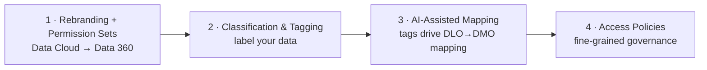
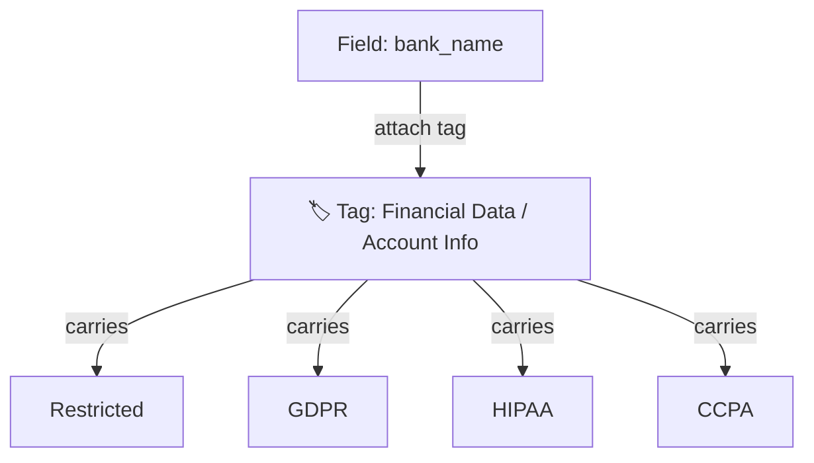
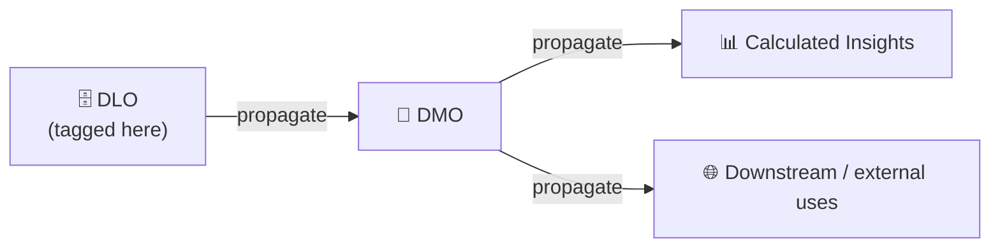
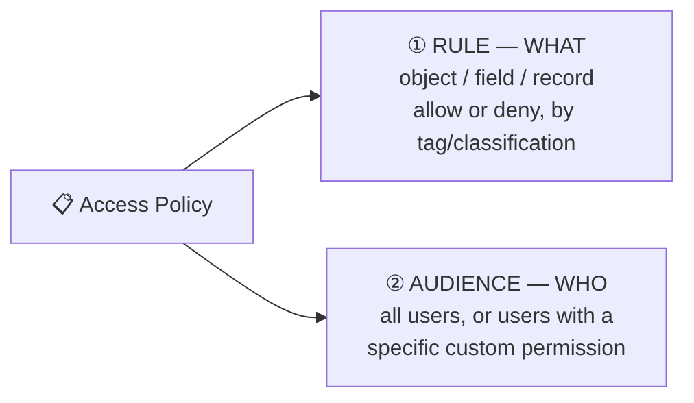
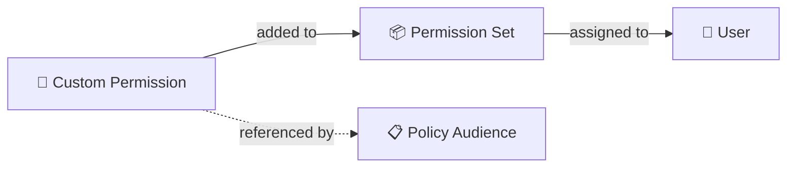
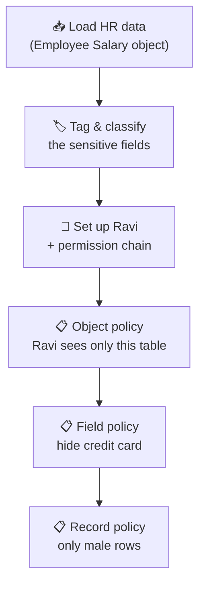

# 🆕 Data 360 — Section 5: Dreamforce '25 Updates & Data Governance

> The recent **Data Cloud → Data 360** changes from Dreamforce '25, plus the full **data governance** model: tagging, classification, AI-assisted mapping, and **object / field / record-level access control** — with a complete Employee Salary use case.
>
> *My own study notes, in my own words. Diagrams are original (Mermaid). Raw slides/scripts kept private.*

---

## The 4 big changes in this release

They build on each other: you **tag** your data (2), which lets AI **map** it (3), and those same tags power **access policies** (4).

---

# PART 1 — Rebranding & Permission Set Changes

## 1.1 Data Cloud is now Data 360
At Dreamforce '25, **Data Cloud was rebranded to Data 360.** It's a strategic move (the "360" family: Customer 360, Agentforce 360…), but it came with **real feature changes**, not just a name.

## 1.2 Permission set changes
The standard permission sets were reorganized. Here's the full picture:

| Old name | Status now | New / current name |
|---|---|---|
| Data Cloud Home Org Integration User | ✅ Unchanged | (same) |
| Data Cloud User | ✅ Unchanged | (same) |
| Data Cloud **Marketing Admin** | ⚠️ Discontinued → **Legacy** | (folded into new sets) |
| Data Cloud **Data Aware Specialist** | ⚠️ Discontinued → **Legacy** | (folded into new sets) |
| Data Cloud **Marketing Manager** | 🔄 Renamed | **Data Cloud Activation Manager** |
| Data Cloud **Marketing Specialist** | 🔄 Renamed | **Data Cloud Activation Specialist** |
| Data Cloud **Admin** | 🔄 Renamed (+ new permissions) | **Data Cloud Architect** |
| — | 🆕 **New** | **Salesforce Connector** |
| — | 🆕 **New** | **Data-Space Aware** |

**Key notes:**
- Discontinued sets now show a **"Legacy"** prefix in your org (e.g. *Legacy Data Aware Specialist*). They still work but get **no new features** — migrate off them.
- The renames aren't cosmetic — **permissions were added**. Example: the new **Data Cloud Architect** can now also **define data spaces** (the old Admin couldn't).
- **Data-Space Aware** is important: access it grants **only applies to the data spaces you associate it with** — so you can give someone rights that are automatically scoped to their data space, without cloning sets.

> 📌 See the separate *Permission Sets & Data Spaces* doc in this repo for the full matrix. This section is about *what changed* in the Dreamforce '25 release.

---

# PART 2 — Classification & Tagging

This is the foundation for everything else in governance. When you bring data in, you can now **label** it.

## 2.1 Tags vs Classifications (know the difference)
- A **Tag** is a **business label** describing *what the data is* — e.g. `Financial Data`, `Personal Identity Information (PII)`, `Account Info`, `Confidential`.
- A **Classification** is a **sensitivity / regulatory label** describing *how it must be handled* — e.g. `Restricted`, `GDPR`, `HIPAA`, `CCPA`, `CPNI`.
- **A tag carries classifications.** When you attach a tag like "Financial Data → Bank Name," it automatically brings along its linked classifications (Restricted, GDPR, HIPAA, etc.).

Many standard tags/classifications ship **by default**, but you should create your own based on **business needs** — the same field (e.g. credit card) might be "Financial" for one company and "PII" for another.

## 2.2 Two levels: Object tagging vs Field tagging
You can tag in **two places**:
- **Field tagging** — tag an individual field (e.g. `salary`, `credit_card`).
- **Object tagging** — tag the **whole object** (the entire DLO or DMO, e.g. "Employee Salary Data" = Financial).

Both matter later — some policies target field tags, others target object tags.

## 2.3 Suggest Tags (AI)
Data 360 can **auto-suggest tags** using an LLM that reads your field metadata (the **Suggest Tags** feature). It does the heavy lifting; a human just reviews and approves.

## 2.4 Tag Propagation ⭐
Tags don't have to be re-done at every layer. **Propagate Tags** pushes labels downstream automatically:
- **Object-level tags** propagate to related **downstream objects**.
- **Field-level tags** propagate to the **matching fields** in those objects.

**Where you do it:** *Data Governance → Tag Manager*, where you pick DLOs, DMOs, or Calculated Insights, attach tags to objects/fields, then **Propagate Tags**. You can also tag a DMO directly via **Edit Tagging**.

> 🔑 **One-liner:** tag once, propagate everywhere — so wherever a field travels (DLO → DMO → insights → Agentforce), its security label travels with it.

---

# PART 3 — AI-Assisted Mapping (DLO → DMO)

Mapping a DLO to a DMO used to be **manual and tedious** — field by field. Now, because your data is **tagged and classified**, **AI does most of the mapping** for you, using those labels to figure out where each field belongs in the standard model.

> ⚠️ **Human-in-the-loop:** AI does the heavy lifting, but you still **review** the auto-mapping to confirm it's correct. Trust, but verify.

Bonus: when you connect a **newly tagged DLO** to a DMO, the DMO **inherits all the tags/classifications automatically** — so the new object is governed from the moment it's created.

---

# PART 4 — Data Governance & Access Policies

## 4.1 Why governance (beyond data spaces)
**Data spaces** are a **coarse** boundary — good for separating whole brands/regions/companies within one org. But inside a data space you often need **finer** control: hide a sensitive object from some users, hide a single field (like salary), or show only some rows.

Before this release, that fine-grained control didn't exist in Data Cloud. **Data governance fills that gap** — like standard Salesforce object/field/record security, but for Data Cloud objects.

## 4.2 The three layers governance protects
1. **Object/data-space access control** — restrict which DLOs/DMOs a user can even see.
2. **Field-level security** — hide sensitive fields (salary, credit card, SSN) from certain users.
3. **Agent data protection** — the same rules apply to **Agentforce agents**, so an AI agent can't reveal data (e.g. a salary) the asking user isn't allowed to see. Policies apply consistently across **Agentforce, analytics, and segmentation**.

## 4.3 How it works under the hood: ABAC
Data 360 governance uses **Attribute-Based Access Control (ABAC)**: access is decided by combining **data attributes** (the tags/classifications you applied) with **user attributes** (their permission/role). This is more flexible than rigid role-based control — you write rules like *"deny any data tagged PII to users outside the Support team."*

## 4.4 A policy = Rule + Audience
Every access policy has **two parts**:

- **Rule (what to protect):** choose **Object**, **Field**, or **Record**; choose **Allow** or **Deny**; and the condition (usually *tag is / classification is*).
- **Audience (who it applies to):** all users, or a targeted group.
- The default policy in a new org is **"Allow All"** (all data access) — you edit it or add new policies in **Data Governance → Policies → Policy Builder**.

## 4.5 ⚠️ The audience gotcha (important workflow)
A policy's audience can **only** target users via a **custom permission** — you cannot point a policy directly at a user. And you can't assign a custom permission straight to a user either. So the chain is:

**Create custom permission → put it in a permission set → assign the set to the user → reference the custom permission in the policy's audience.** Miss this chain and your policy has no one to apply to.

---

# PART 5 — Complete Use Case: Protecting Employee Salary Data 🎬

This use case pulls every concept in this section together into one real story. Read the scenario first — the steps will make far more sense once you can see *why* you're doing each one.

## 5.1 The scenario

**The company:** a business has just loaded its **HR employee dataset** into Data 360. Each row is one employee, and the columns include name, email, gender, city, **bank name**, **credit card number**, and **salary/income** — highly sensitive stuff.

**The people involved:**
- **Sara — the admin.** She owns Data 360 and sets up the security.
- **Ravi — an analyst (the "restricted user").** He needs to *look at* HR data to do reporting, but he should **not** have free run of everything.

**The problem:** by default, once data is in Data 360, a user like Ravi can see **every** data lake object in the org, **every** field, and **every** row. That's a compliance nightmare — Ravi could open the HR table and read everyone's credit card and salary.

**What Sara needs to enforce (three separate rules):**

| # | Rule | Level | Plain meaning |
|---|---|---|---|
| 1 | Ravi may see **only** the Employee Salary object — nothing else | **Object** | which *tables* he sees |
| 2 | **Nobody** may see the credit-card field | **Field** | which *columns* are visible |
| 3 | Ravi may see **only male-gender rows** | **Record** | which *rows* he sees |

Those three rules are exactly the three levels of Data 360 governance — object, field, and record. Here's how Sara builds it.

## 5.2 Step-by-step build

### Step 1 — Load the data and give it a unique key
Sara ingests the HR CSV so it becomes a governable object.
1. **Data Streams → New → File Upload → Next**, and drag in the CSV.
2. Clean up the object/API name (remove the `.csv`).
3. The file has no unique ID column, so she **creates a formula field** using the `UUID` function (type: Text) and sets it as the **Primary Key** — every record needs a unique key.
4. Leave it in the **default** data space → **Deploy.**

*Result:* an **Employee Salary** data lake object (DLO) now exists, holding the HR records.

### Step 2 — Label the sensitive data (tag & classify)
Governance can't protect what it can't recognize, so Sara labels the data first. **Data Governance → Tag Manager →** open the Employee Salary object.
- **Tag the sensitive fields** (field tagging): `bank_name` → *Financial Data*, `credit_card` → *Credit Card Number*, `email`/`first_name`/`gender` → *PII*, `salary` → *Household Income*. Each tag automatically brings its classifications (GDPR, HIPAA, Restricted…).
- **Tag the whole object** (object tagging): attach *Financial Data* to the **Employee Salary object itself** — she'll need this in Step 4 to whitelist the table.

*Why this matters:* Data 360 policies decide access by **tag** (the ABAC model), so the labels you attach here are what the policies will "hook onto" later.

### Step 3 — Propagate the tags
So the labels follow the data everywhere, Sara clicks **Propagate Tags** → picks the object → **Next → Propagate.** Now if this data flows into a DMO, a calculated insight, or an Agentforce answer, the same protection travels with it.

### Step 4 — Set up Ravi and the permission chain
Sara creates the restricted user and wires up the permission chain that policies require.
1. **Setup → Users → New:** create Ravi (**Standard User** profile) and assign the **Data Cloud User** permission set. Finish the email/password setup.
2. Create a **permission set** (e.g. `HR Analyst Access`).
3. Create a **custom permission** (e.g. `HR_Data_Access`).
4. **Add the custom permission to the permission set**, then **assign the permission set to Ravi.**

*Why the chain?* (See Part 4.5.) A policy's audience can only target a **custom permission** — and a custom permission can't be assigned to a user directly. So it must travel: custom permission → permission set → user. Ravi now "carries" the `HR_Data_Access` custom permission, which the policies will point to.

### Step 5 — Rule 1: Object policy (Ravi sees only the HR table)
**Data Governance → Policies → New.**
- **Rule (what):** Resource = **Object** → **Allow access** → where **Tag is** *Financial Data* (the object tag from Step 2).
- **Audience (who):** users with the **`HR_Data_Access`** custom permission (i.e. Ravi).
- **Save & Activate.**

*Result:* Ravi now sees **only** the Employee Salary object. Every other DLO and DMO disappears from his view, because only this object carries that tag. *(If Sara later wants to expose another object to him, she just tags it the same way.)*

### Step 6 — Rule 2: Field policy (hide the credit card from everyone)
**New Policy**, name it *No Credit Card Details*.
- **Rule (what):** Resource = **Field** → **Deny field access** → where **Tag is** *Credit Card Number*.
- **Audience (who):** **All Users** (nobody should see it).
- **Save & Activate.**

*Result:* the credit-card column vanishes for everyone. The object that showed **13 columns now shows 12** — proof the field is hidden, not just blanked.

### Step 7 — Rule 3: Record policy (Ravi sees only male rows)
**New Policy**, name it *Gender Filtering*.
- **Rule (what):** Resource = **Record** → **Allow access** → object = Employee Salary → condition **gender = male**.
- **Audience (who):** the same restricted audience (or All Users).
- **Save & Activate.**

*Result:* Ravi's view of the table now returns **only the male-gender rows**; the rest are filtered out for him.

## 5.3 The payoff

Ravi logs in and opens Data 360. Instead of the whole org's data, he sees **one table** (object rule), **without the credit-card column** (field rule), showing **only male employees** (record rule) — exactly the slice he's allowed to work with, and nothing more. Sara wrote three short policies and never touched a single row of data by hand.

> 🔑 **The mental model:** **Object** = which *tables*, **Field** = which *columns*, **Record** = which *rows*. Stack the three and you can carve out precisely "this person sees exactly this slice." And because it's driven by tags, the same protection automatically covers Agentforce, analytics, and segmentation too.

---

# PART 6 — Interview / Exam Questions

**Q: What changed at Dreamforce '25 for Data Cloud?**
It was rebranded to **Data 360**, with real changes: reorganized permission sets, new classification & tagging, AI-assisted mapping, and fine-grained access policies (governance).

**Q: Which permission sets became legacy, renamed, or new?**
Legacy: Marketing Admin, Data Aware Specialist. Renamed: Marketing Manager → **Activation Manager**, Marketing Specialist → **Activation Specialist**, Admin → **Architect** (with added rights like defining data spaces). New: **Salesforce Connector**, **Data-Space Aware**.

**Q: Tag vs Classification?**
A **tag** is a business label (Financial Data, PII); a **classification** is a sensitivity/regulatory label (GDPR, HIPAA, Restricted). A tag carries its classifications.

**Q: Object tagging vs field tagging?**
Object tagging labels the whole DLO/DMO; field tagging labels individual fields. Policies can target either.

**Q: What is tag propagation?**
Pushing tags downstream automatically — object tags to related objects, field tags to matching fields — so labels flow DLO → DMO → insights → Agentforce without re-tagging.

**Q: What model powers Data 360 access policies?**
**ABAC** (Attribute-Based Access Control) — access is decided from data attributes (tags/classifications) plus user attributes, rather than rigid roles.

**Q: Data spaces vs data governance — what's the difference?**
Data spaces are a **coarse** whole-org boundary (separate brands/regions). Governance adds **fine-grained** object/field/record control *within* a data space.

**Q: What are the two parts of an access policy?**
A **Rule** (what: object/field/record, allow/deny, by tag) and an **Audience** (who: all users or a custom permission).

**Q: Why must a policy's audience use a custom permission?**
Policies can only target users via a **custom permission**. Since a custom permission can't be assigned directly to a user, you add it to a **permission set**, assign that to the user, then reference the custom permission in the audience.

**Q: What is "agent data protection"?**
Governance policies apply to **Agentforce** too — so an AI agent won't reveal data (e.g. a salary) that the asking user isn't authorized to see. Policies enforce consistently across Agentforce, analytics, and segmentation.

**Q: How do you show only certain rows to a user?**
A **record-level** policy — allow access where a field condition is met (e.g. `gender = male`).

---

# PART 7 — Study Aids

## ✅ Key Takeaways
1. **Data Cloud → Data 360** (Dreamforce '25) — with real feature changes, not just a name.
2. Permission sets: Admin→**Architect**, Marketing Manager→**Activation Manager**, Marketing Specialist→**Activation Specialist**; new **Salesforce Connector** & **Data-Space Aware**; Marketing Admin & Data Aware Specialist → **legacy**.
3. **Tag** = business label; **Classification** = regulatory label; a tag carries classifications.
4. **Propagate tags** so labels flow downstream (and AI uses them to map DLO→DMO).
5. Governance = fine-grained **object / field / record** access, powered by **ABAC** using tags.
6. A policy = **Rule (what) + Audience (who)**; audiences target users via a **custom permission**.
7. Governance also protects **Agentforce** answers.

## 🔁 Flashcards
- **Q:** New name for Data Cloud? → **A:** Data 360.
- **Q:** Admin permission set renamed to? → **A:** Data Cloud Architect.
- **Q:** Two new permission sets? → **A:** Salesforce Connector, Data-Space Aware.
- **Q:** Tag vs classification? → **A:** Tag = business label; classification = regulatory/sensitivity label.
- **Q:** Access-control model? → **A:** ABAC (attribute-based).
- **Q:** Three policy levels? → **A:** Object, Field, Record.
- **Q:** Policy audience targets users via…? → **A:** A custom permission (added to a permission set assigned to the user).
- **Q:** Default policy in a new org? → **A:** Allow All.
- **Q:** Does governance affect Agentforce? → **A:** Yes — agents can't reveal data the user isn't allowed to see.

## 📖 Glossary
| Term | Meaning |
|---|---|
| **Data 360** | The rebranded Data Cloud (Dreamforce '25). |
| **Tag** | Business label for data (Financial, PII, Confidential). |
| **Classification** | Regulatory/sensitivity label (GDPR, HIPAA, Restricted). |
| **Object tagging** | Tagging a whole DLO/DMO. |
| **Field tagging** | Tagging an individual field. |
| **Propagate Tags** | Pushing tags downstream to related objects/fields. |
| **Suggest Tags** | AI/LLM feature that recommends tags from metadata. |
| **Tag Manager** | The Data Governance tool where you tag and propagate. |
| **Access Policy** | A rule + audience controlling data access. |
| **ABAC** | Attribute-Based Access Control (tags + user attributes). |
| **Object/Field/Record policy** | Controls which tables / columns / rows a user sees. |
| **Data-Space Aware (perm set)** | Grants access scoped to associated data spaces. |
| **Agent data protection** | Governance applied to Agentforce agents. |
| **Dynamic data masking** | Hiding/obfuscating sensitive values based on the user. |

---

*Part of the Data Cloud / Data 360 repo. This covers Section 5 (Dreamforce '25 updates & governance); other docs cover concepts, permission sets, tabs/DSO-DLO-DMO, and ingestion.*
