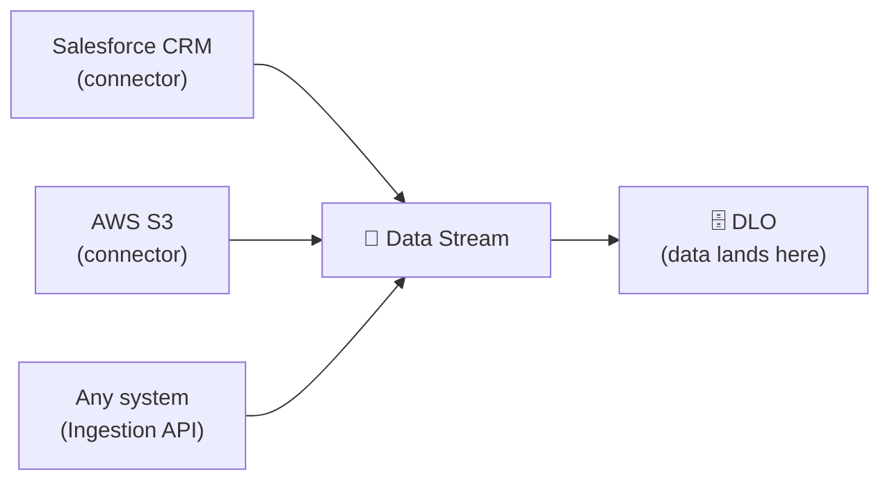

# 📥 Data Cloud — Section 4: Data Ingestion & Storage (Complete Guide)

> How to get data **into** Data Cloud from every source: Salesforce CRM, AWS S3, and the programmatic **Ingestion API** (with a full **Postman + Client Credentials** walkthrough for engagement data). Plus how to view the loaded data, and interview questions.
>
> *My own study notes, in my own words. Diagrams are original (Mermaid). Raw slides/scripts kept private.*

**The big idea of this section:** no matter which source you use, every ingestion follows the same path — connect a source → pull it in with a **data stream** → the data lands in a **DLO**. The method changes; the destination doesn't.



---

# PART 1 — Concepts That Apply to EVERY Ingestion

Before the methods, learn these five decisions — you make them **every single time** you create a data stream, regardless of source.

## 1.1 A data stream always creates a DLO
When you deploy a data stream, Data Cloud **automatically creates a Data Lake Object (DLO)** to hold the data. Stream = the pipe; DLO = where the data lands and lives.

## 1.2 Category — Profile, Engagement, or Other ⭐ (exam favorite)
Every stream must be categorized. **Pay attention — this is a common certification and interview question.**

| Category | Use it for | Key field | Example |
|---|---|---|---|
| **Profile** | *Who* the customer is — personal/identity data you'll de-duplicate | identity | Name, email, phone, address |
| **Engagement** | *What* happened — time-based events / transactions | **event time** | Purchases, clicks, car sending live updates |
| **Other** | Reference/lookup data that's neither | — | Product catalog, store list |

> 💰 **Architect's eye:** don't let everyone default to **Profile**. More profile data = **higher Data Cloud cost**. Only mark data Profile when it truly is identity data you need to unify.

## 1.3 Primary key (must be unique) ⭐
Every stream needs a **primary key** — a field that's **unique across all records**.
- **From Salesforce:** the Record ID is recognized and set as the primary key **automatically**.
- **From external sources (AWS, API):** you must **assign it manually** (e.g. a Customer Number).
- **No unique field?** Create a **formula field** that generates a unique ID (say 10–15 digits) and use that.
- ⚠️ **Duplicates get rejected.** If your chosen key has duplicate values, Data Cloud **drops the duplicates** and only ingests the unique ones. *(Real example: a 1,000-row file with 103 duplicate customer numbers ingests only 897 rows.)*

## 1.4 Refresh mode — Upsert vs Full Refresh 💰
How the data updates on each run:
- **Upsert** — only **new/changed** records are updated. ✅ **Recommended best practice.**
- **Full Refresh** — **all** records reload every time, changed or not.

> 💰 **Architect's eye:** Full Refresh reloads everything each cycle, so credits (cost) shoot up. Watch for anyone setting Full Refresh — it's a common cause of a surprise bill. Prefer **Upsert**.

## 1.5 Refresh frequency — on-demand vs batch
- **None (on-demand):** data only updates when someone manually clicks **Refresh**.
- **Batch (scheduled):** updates on a frequency you set — every 5/15/30 min, hourly, daily, weekly, or monthly (with a chosen day/time).

## 1.6 Filters at ingestion 💰
You can filter *what* gets imported (e.g. only `Country = Poland`). Less data ingested = **lower cost**. As an architect, agree filters with the business so you don't pay to store data nobody uses.

> 🧠 **Subtle but important (from the standard-object demo):** a filter is applied to the **DLO**, not the raw stream. So the **stream may show all 20 records**, but the **DLO only stores the 2** that passed the filter. Always verify the *DLO* count in Data Explorer, not just the stream count.

---

# PART 2 — Method 1: Ingest from Salesforce CRM (Connector)

Use this when your data already lives in a Salesforce org (custom **or** standard objects).

## 2A — Connect the Salesforce org (one-time)
1. In your **Data Cloud org**, go to **Setup → Data Cloud Setup**, search **Salesforce CRM**.
2. Click **New** → choose **Production/Developer** or **Sandbox** (a Developer Edition counts as "Production/Developer").
3. Name it, click **Proceed**, then **log in** with a user that has **API access** (an admin user works).
4. The org appears as a connection (give it a clear alias, e.g. `Zara_Data_SFDC`).

> 🔑 The org where Data Cloud itself is hosted is *also* listed — but you connect the **separate source org** that holds your data, not the host.

## 2B — Ingest a CUSTOM object
1. Go to **Data Streams → New → Salesforce CRM → Next**.
2. Select the connected **source org**.
3. You'll see **standard bundles** (e.g. "Sales" auto-pulls Account/Contact/Lead). To pull one object instead, choose the object list and **search your custom object** (e.g. `Zara Ecommerce Data`) → **Next**.
4. **Field selection:** standard/system fields (OwnerId, CreatedDate, etc.) are pre-checked — **uncheck** any you don't need. Check the **custom fields** you want. Formula fields appear here too.
5. *(Optional)* **Create a formula** — e.g. concatenate First Name + Last Name into one field, choosing the output type.
6. **Name the DLO** clearly (e.g. `Zara_Online_Store_Data`).
7. Pick the **category** (Profile / Engagement / Other) — see Part 1.2.
8. **Primary key:** auto-set to the Salesforce Record ID.
9. **Next → assign a Data Space** (or Default) → *(optional)* add **filters** (e.g. `Country = Poland`).
10. **Deploy.** The stream is created (status: Processing → Active). A **DLO is auto-created**. Refresh to pull the data (can take ~5 minutes).
11. Verify in **Data Explorer → Data Lake → your DLO**.

## 2C — Ingest a STANDARD object (the differences)
Same flow, with a few notes:
- At object selection you can pull a **bundle** (Account+Contact+Lead) or just **one** (e.g. Contact).
- Contacts usually suit the **Profile** category — but pick **Other** if you won't use them for identity (e.g. contacts you're only ingesting for practice).
- **Filter example:** add `MailingCountry = USA` (case-sensitive!). Result: the **stream shows all 20** contacts, but the **DLO stores only the 2** that matched (see Part 1.6).
- If the stream is slow to load, use **Update Status** (not just Refresh) to nudge it.

---

# PART 3 — Method 2: Ingest from AWS S3 (Connector)

Use this for CSV files sitting in an S3 bucket.

## 3A — Authenticate the S3 connector (one-time)
1. **Data Cloud Setup → Connectors → New → Amazon S3 → Next**.
2. Name it (e.g. `Zara_Store_Data`).
3. In **AWS**, create an **IAM user access key** (IAM → your user → Security credentials → Create access key → use case "Third-party service"). Copy the **Access Key** and **Secret Access Key**.
4. Paste both into Data Cloud, plus the **Bucket Name** (and a **Parent Directory** only if the file sits in a subfolder — otherwise leave `/`).
5. Click **Test Connection** → should say **connection established** → **Save**.

> ⚠️ **If Test Connection fails** with *"Permission denied for accessing resources in the given location,"* the keys authenticated but the IAM user lacks bucket read rights. The user's policy must allow **both** `s3:GetObject` (on `arn:aws:s3:::bucket/*`) **and** `s3:ListBucket` (on `arn:aws:s3:::bucket`). Missing **`s3:ListBucket`** is the classic cause — the connector lists the bucket during the test. *(This exact fix is a great hands-on story for interviews.)*

## 3B — Create the S3 data stream
1. **Data Streams → New →** pick **Amazon S3** (now under "other sources," since you authenticated it) → **Next**.
2. Confirm bucket / parent directory. Set **file type = CSV** and paste the **full file name including `.csv`**. Rename the stream/DLO clearly (e.g. `Zara_Store_Data`).
3. **Field review:** all CSV columns appear. You can change a field's **type** (e.g. Age → Number) and its **label/API name** (but not the source header). You can also add **formula fields**. *(Lineage fields like Data Source / Data Source Object are added automatically.)*
4. Pick the **category** (e.g. Profile, to unify online + offline store customers).
5. **Primary key:** **assign manually** — e.g. `Customer Number`. No unique field? Create a formula that generates a unique ID (see Part 1.3).
6. **Next → Data Space →** *(optional)* filters.
7. **Refresh settings:** choose a **frequency** (e.g. Weekly, Monday midnight, or None for on-demand) and a **refresh mode** (**Upsert** recommended; Full Refresh costs more).
8. **Deploy.** Verify in **Data Explorer → Data Lake → your DLO**.

> 🧠 **Duplicate-key reality:** if `Customer Number` has duplicates, those rows are **rejected**. (Example: 1,000 rows with 103 duplicates → 897 ingested.) Fix by asking the source team to clean the key, or delete and rebuild the stream using a **formula-generated unique ID**.

---

# PART 4 — Method 3: The Ingestion API (programmatic)

## 4.1 What it is & why it exists
Connectors are great, but they only cover systems Salesforce **has a connector for**. For anything else — a legacy app, a custom system, real-time events — you use the **Ingestion API**: a REST-based, programmatic way to push data into Data Cloud.

**Key features:**
- **Real-time / near-real-time** — push data the moment it happens (vs a connector's fixed schedule).
- **Universal** — any system that can call a REST API can connect (almost everything).
- **Secure** — uses **OAuth 2.0** authentication.
- **Developer-controlled** — you own the integration logic (not Salesforce).

**Common use cases:** mobile app events (e.g. "user abandoned cart → send a WhatsApp nudge"), **IoT sensors** (temperature, location, live car telemetry), and **legacy systems** with no connector.

## 4.2 Connector vs Ingestion API

| | **Connector** | **Ingestion API** |
|---|---|---|
| Setup | Low-code / no-code | Requires coding |
| Timing | Mostly **batch** (or on-demand) | **Real-time** / near-real-time |
| Flexibility | Standard, fixed | Custom, flexible |
| Controlled by | Salesforce | Your developers |
| Use when | Standard source, no coding needed | No connector, real-time, or custom auth needed |

## 4.3 Two types of Ingestion API ⭐ (interview favorite)

### Streaming API
- **Continuous, real-time** — for live data flow.
- Uses a **fire-and-forget** pattern: your system keeps sending; Data Cloud does **not** send an acknowledgement back.
- Sends **micro-batches** — yes, **more than one record per request** (a common senior-level trick question — it's *not* limited to one record).
- **Limit: 200 KB per request.** Deletes supported up to **200 records**.
- ⚠️ **Costly** — only use when real-time is truly needed.

### Bulk API
- **Not real-time** — for large/historical loads (e.g. first-time backfill).
- **Job-based sequence:** ① create a job (upsert or delete) → ② upload the file (**CSV**, up to **150 MB**) → ③ monitor. Programmatic and slightly complex.
- Does a **full refresh**, not partial.
- Use for historical data, backfilling a new org, or scheduled large updates.

> 🔑 **One-liner:** **Streaming = real-time, small (200 KB), fire-and-forget.** **Bulk = large (150 MB CSV), job-based, not real-time.**

---

# PART 5 — 🛠️ Hands-On: Ingest ENGAGEMENT Data via Postman (Client Credentials)

This is the full method for pushing engagement data through the **Streaming Ingestion API**, authenticating with the **OAuth Client Credentials flow**. It involves an admin (setup), a developer (Postman), and the auth exchange.

Here's the auth flow at a glance — note it's a **two-token** process:

```mermaid
flowchart TB
    P["🧑‍💻 Postman"] -->|"1 · client_credentials<br/>client_id + client_secret"| SF["Salesforce core<br/>/services/oauth2/token"]
    SF -->|"returns SF access_token + instance_url"| P
    P -->|"2 · token exchange<br/>/services/a360/token"| DC["Data Cloud token endpoint"]
    DC -->|"returns Data Cloud token + DC instance URL"| P
    P -->|"3 · POST records<br/>/api/v1/ingest/sources/{connector}/{object}"| ING["Data Cloud Ingestion"]
    ING -->|'{ accepted: true }'| P
```

## Step 1 — Create the Ingestion API connector + schema (admin, in Data Cloud)
1. **Data Cloud Setup → Ingestion API → New**, give it a name (this becomes your **connector name**) → **Save**.
2. **Upload a YAML (OpenAPI) schema** that defines your object and fields. Minimal example for an engagement object:
   ```yaml
   openapi: 3.0.3
   components:
     schemas:
       cart_event:
         type: object
         properties:
           customer_id:   { type: string }
           event_type:    { type: string }
           product_id:    { type: string }
           event_time:    { type: string, format: date-time }
   ```
   *(The object name here — `cart_event` — is what you'll POST to later.)*

## Step 2 — Create the data stream from that Ingestion API (admin)
1. **Data Streams → New →** select your **Ingestion API** connector → pick the object (`cart_event`).
2. Set **category = Engagement** (it's time-based event data).
3. Set the **primary key** and, because it's Engagement, the **event time field** (`event_time`).
4. Assign **Data Space** → **Deploy**. The connector status becomes **In Use**.

## Step 3 — Create a Connected App with Client Credentials (admin)
1. **Setup → App Manager → New Connected App** (Salesforce core, not Data Cloud setup).
2. **Enable OAuth Settings.** Callback URL: `https://oauth.pstmn.io/v1/callback` (Postman's).
3. **OAuth scopes** — add:
   - `cdp_ingest_api` — *Manage Data Cloud Ingestion API data* (required)
   - `api` — *Access and manage your data*
   - `refresh_token, offline_access` — *Perform requests at any time*
4. ✅ **Enable Client Credentials Flow** (checkbox in the OAuth section).
5. **Save**, then **Manage → Edit Policies**:
   - **Permitted Users:** "All users may self-authorize" (or admin-approved).
   - **IP Relaxation:** "Relax IP restrictions."
   - **Client Credentials Flow → Run As:** pick a user (this user's permissions become the token's permissions — give it Data Cloud access).
6. **Manage Consumer Details** → copy the **Consumer Key (= client_id)** and **Consumer Secret (= client_secret)**.

> 🔑 **Why Client Credentials?** It's server-to-server auth with **no user login** — perfect for a backend system pushing data. (The alternative, JWT Bearer, is also common; the official Postman collection supports both. Client Credentials is the simplest to test.)

## Step 4 — Get the Salesforce access token (Postman)
Send a **POST** (no body needed; params in the URL):
```
POST https://<MyDomain>.my.salesforce.com/services/oauth2/token
     ?grant_type=client_credentials
     &client_id=<CONSUMER_KEY>
     &client_secret=<CONSUMER_SECRET>
```
Response gives you a Salesforce **`access_token`** and **`instance_url`**.

## Step 5 — Exchange it for a Data Cloud token (Postman)
Data Cloud needs its **own** token. Exchange the Salesforce token:
```
POST https://<instance_url>/services/a360/token
  grant_type        = urn:salesforce:grant-type:external:cdp
  subject_token      = <the Salesforce access_token from Step 4>
  subject_token_type = urn:ietf:params:oauth:token-type:access_token
```
Response gives a **Data Cloud access token** and a **Data Cloud instance URL** (the tenant-specific endpoint shown on your Ingestion API connector page).

> 💡 **Shortcut:** fork the official **Salesforce Data Cloud Ingestion API Postman collection** — its pre-request scripts do Steps 4–5 automatically and store the tenant token in a variable. You just fill in `client_id`, `client_secret`, and your domain in the collection **Variables**.

## Step 6 — Send the engagement data (Postman)
POST your records to the **streaming** endpoint, using the **Data Cloud token** and **Data Cloud instance URL**:
```
POST https://<dataCloud_instance_url>/api/v1/ingest/sources/<connector_name>/<object_name>
Authorization: Bearer <Data Cloud access token>
Content-Type: application/json
```
Body:
```json
{
  "data": [
    { "customer_id": "C-1001", "event_type": "cart_add", "product_id": "P-55", "event_time": "2026-02-18T10:15:00Z" },
    { "customer_id": "C-1002", "event_type": "cart_add", "product_id": "P-88", "event_time": "2026-02-18T10:17:00Z" }
  ]
}
```
A success response is:
```json
{ "accepted": true }
```

## Step 7 — Validate & verify
- **Validate first (optional):** append **`/actions/test`** to the endpoint to check your JSON against the schema **without** saving.
- **Verify:** streaming data processes in **~3–15 minutes**. Then check **Data Explorer → Data Lake → your DLO** to see the records.

> ⚠️ **Note:** exact endpoints/scopes can change between releases — if a call fails, confirm against the current Salesforce "Ingestion API" developer docs, and double-check your Run-As user actually has Data Cloud permissions.

---

# PART 6 — Viewing Your Data: Data Explorer vs Query Editor

Once data is loaded, two tools let you inspect it.

## Data Explorer (no code)
- Pick a **Data Space** and an object (DLO / DMO / Calculated Insight) to preview rows.
- **Edit columns** to show only the fields you want; **add filters** (e.g. `Age = 56`) — all point-and-click.
- Bonus: it can **generate/copy the SOQL query** for what you're viewing, which you can run in a tool like Salesforce Inspector.
- 👉 Best for **quick, no-code** previews (non-developers).

## Query Editor (SQL)
- **New → pick a Data Space → Save.** Query **DLOs, DMOs, Calculated Insights**, and more.
- Write and **Run** your own **SQL** (structured query language); shows results inline.
- **Save queries** to re-run later without retyping.
- 👉 Best for **developers** and for conditions the Explorer's simple filters can't express. More powerful than Data Explorer.

> 🔑 **Explorer = easy preview (no code).** **Query Editor = full SQL power (developers).**

---

# PART 7 — Interview Questions & Answers

Grouped by topic, in plain language. *(Some source files call DSO a "Data Staging Object"; Salesforce's common term is "Data Source Object" — both mean the temporary staging object.)*

## Salesforce CRM → Data Cloud

**Q: Why connect Salesforce CRM to Data Cloud?**
To centralize customer data into one unified view, improve reporting/personalization, and bring **custom** objects (unique business data) into Data Cloud for analysis and segmentation.

**Q: Prerequisites?**
Access to the source CRM org (Dev/Prod/Sandbox), access to the Data Cloud org, and structured data (the object + records to ingest).

**Q: How do you connect the org and why do permissions matter?**
In Data Cloud Setup → Salesforce CRM → New → authenticate the source org with an **API-enabled** user. Then assign the **Data Cloud Salesforce Connector** permission access — without the right permissions, the object's fields **won't appear** during mapping.

**Q: How do you create the data stream?**
Data Streams → New → Salesforce CRM → choose the source org → select the object (or a bundle) → map fields → set category/primary key → assign Data Space → **Deploy**.

**Q: Why does field mapping matter?**
It aligns CRM fields with Data Cloud's structure so data is categorized correctly (e.g. as Profile) and relationships are accurate — the basis for unification and segmentation.

## AWS S3 → Data Cloud

**Q: Why integrate S3 with Data Cloud?**
To bring large volumes of externally-stored (CSV) data — purchases, behavior — into unified profiles for analytics and targeted campaigns.

**Q: Prerequisites?**
An AWS account with rights to manage S3 + IAM, a private bucket with a structured **CSV**, and admin access in Data Cloud to configure connectors/streams.

**Q: How do you set up the AWS side?**
Create an IAM user, grant S3 read access (`GetObject` + `ListBucket`), generate an access key/secret; create a private bucket and upload the CSV.

**Q: How do you connect and create the stream?**
Data Cloud Setup → Other Connectors → AWS S3 → enter access key, secret, bucket → **Test Connection** → Save. Then Data Streams → New → Amazon S3 → point to the CSV → set category, **manually assign the primary key**, refresh mode → Deploy.

**Q: Upsert vs Full Refresh?**
**Upsert** updates only new/changed records (use for frequent changes, cheaper). **Full Refresh** reloads everything (use for a full reset; costs more).

**Q: Common S3 integration problems?**
Wrong credentials, **insufficient IAM permissions** (missing `ListBucket`), or mismatched fields. Fix by validating credentials, testing the connector, and checking the CSV format.

## Ingestion API (content-based)

**Q: What is the Ingestion API and when do you use it?**
A REST-based, programmatic way to push data into Data Cloud — used when there's **no connector**, when you need **real-time** data, or when you need **custom authentication**.

**Q: Streaming vs Bulk Ingestion API?**
**Streaming** = real-time, micro-batches, ≤200 KB/request, fire-and-forget, higher cost. **Bulk** = large loads (CSV ≤150 MB), job-based (create job → upload → monitor), not real-time, full refresh.

**Q: Can a Streaming API request send more than one record?**
**Yes** — it sends micro-batches (multiple records), as long as the request stays under **200 KB**. (Common trick question.)

**Q: Which OAuth scope is required to push data via the Ingestion API?**
`cdp_ingest_api` (Manage Data Cloud Ingestion API data).

**Q: Why is authentication a two-token process?**
You first get a **Salesforce** access token (client credentials), then **exchange** it for a **Data Cloud** token via the token endpoint — the Data Cloud token (and its tenant URL) is what the ingestion endpoint accepts.

## Concepts (cross-cutting)

**Q: Three data stream categories, and the cost trap?**
Profile (identity), Engagement (time-based events), Other (reference). Over-using **Profile** raises cost — only use it for true identity data.

**Q: What happens if the primary key has duplicates?**
Duplicate rows are **rejected**; only unique-key rows ingest. Fix the source key or use a formula-generated unique ID.

**Q: Filter behavior — stream vs DLO?**
An ingestion filter applies to the **DLO**: the stream may show all records, but only filtered records land in the DLO. Verify counts in Data Explorer.

---

# PART 8 — Study Aids

## ✅ Key Takeaways
1. Every source ends the same way: **connect → data stream → DLO.**
2. Every stream needs: a **category**, a **primary key**, a **refresh mode**, and (often) **filters** — all with **cost** implications.
3. **Connector** = no-code, batch. **Ingestion API** = code, real-time/custom.
4. **Streaming** = real-time, 200 KB, fire-and-forget. **Bulk** = 150 MB CSV, job-based, not real-time.
5. Postman auth is **two tokens**: Salesforce token → exchange → Data Cloud token → then POST records.
6. **Data Explorer** = no-code preview; **Query Editor** = SQL power.

## 🔁 Flashcards
- **Q:** What auto-creates when you deploy a data stream? → **A:** A DLO.
- **Q:** Salesforce vs external primary key? → **A:** Salesforce auto-sets Record ID; external sources need it set manually.
- **Q:** Cheapest refresh mode? → **A:** Upsert (only changes).
- **Q:** Streaming request size limit? → **A:** 200 KB (multiple records allowed).
- **Q:** Bulk file limit & format? → **A:** 150 MB, CSV, job-based.
- **Q:** Required ingestion scope? → **A:** `cdp_ingest_api`.
- **Q:** Success response from the streaming endpoint? → **A:** `{ "accepted": true }`.
- **Q:** How to validate a payload without saving? → **A:** Append `/actions/test` to the endpoint.

## 📖 Glossary
| Term | Meaning |
|---|---|
| **Data Stream** | The pipe that ingests a source into Data Cloud. |
| **DLO** | Data Lake Object — where ingested data lands/persists. |
| **Category** | Profile / Engagement / Other classification of a stream. |
| **Primary key** | The unique field identifying each record. |
| **Upsert** | Refresh only new/changed records. |
| **Full Refresh** | Reload all records every run (costlier). |
| **Connector** | No-code bridge to a supported source. |
| **Ingestion API** | Programmatic REST way to push data in. |
| **Streaming API** | Real-time ingestion, ≤200 KB, fire-and-forget. |
| **Bulk API** | Job-based large loads, ≤150 MB CSV. |
| **Client Credentials** | Server-to-server OAuth (no user login). |
| **cdp_ingest_api** | OAuth scope required for the Ingestion API. |
| **Data Explorer** | No-code data preview tool. |
| **Query Editor** | SQL tool for querying DLOs/DMOs/insights. |

---

*Part of the Data Cloud repo. This covers Section 4 (ingestion & storage); other docs cover concepts, permission sets, tabs/DSO-DLO-DMO, identity resolution, and the exam.*
