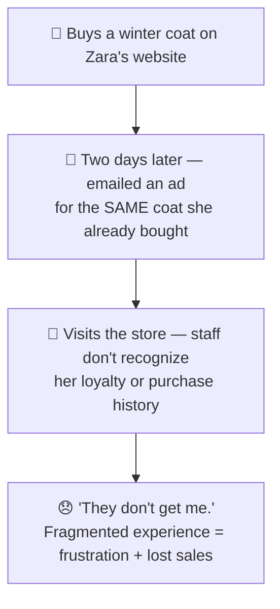
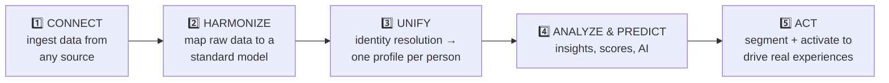
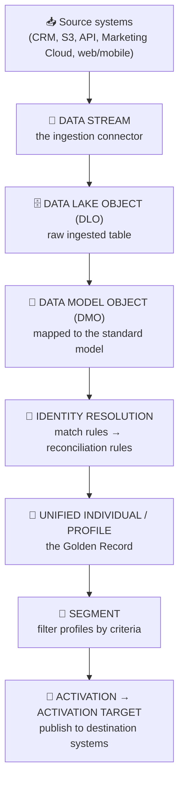
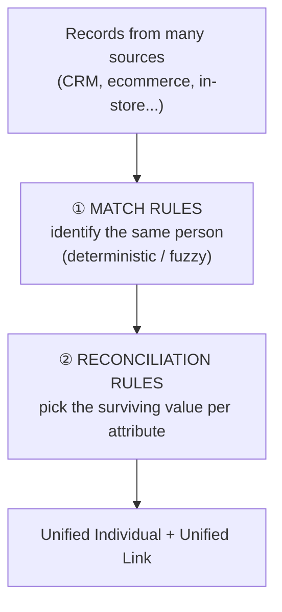
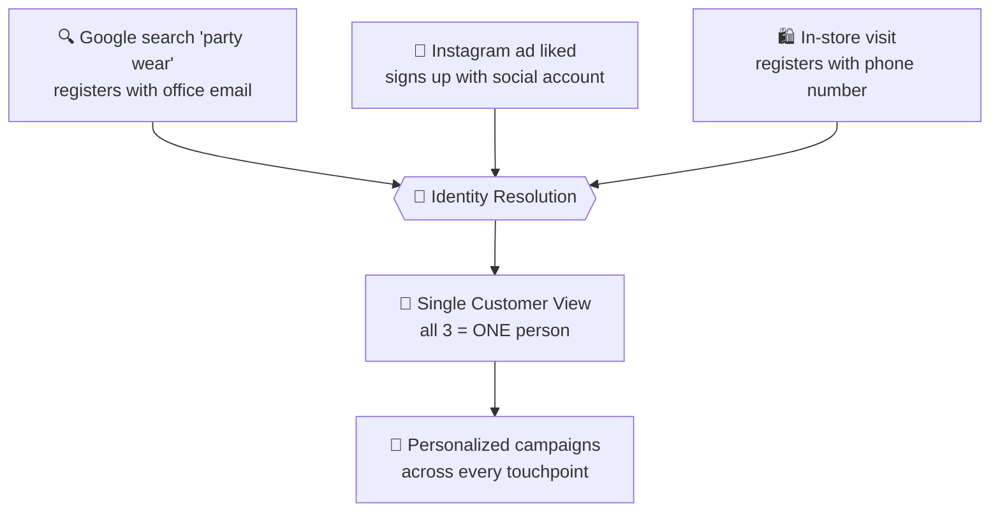
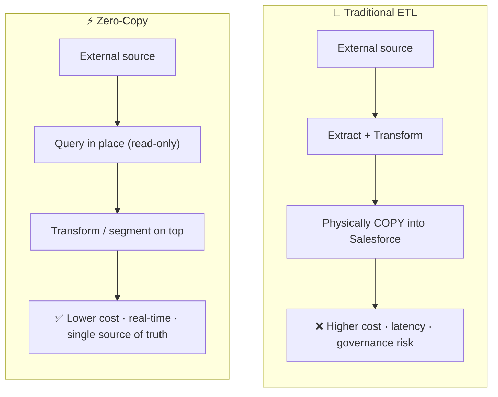
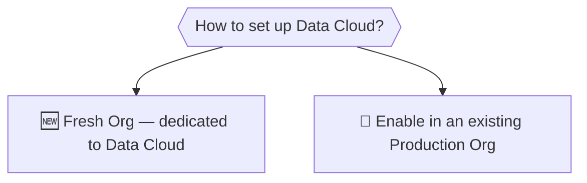

# 🌐 Salesforce Data Cloud — Introduction & Core Concepts

> The foundational reference for this repo. It covers **what Data Cloud is**, **why it exists**, **how it actually works** (architecture + core building blocks), and a **Data Cloud Consultant exam** section with the high-yield points examiners test.
>
> *Written in my own words as study notes. Diagrams are original (Mermaid — they render on GitHub). Raw course slides are kept in a separate private folder, not published here.*

---

## 📑 Contents

- **Part 1 — The Big Picture** · why Data Cloud exists
- **Part 2 — How It Works** · architecture, the data flow, and every core building block
- **Part 3 — Consultant Exam** · format, domain weightings, and high-yield tips
- **Part 4 — Study Aids** · takeaways, flashcards, glossary

---

# PART 1 — THE BIG PICTURE

## 1.1 What is Salesforce Data Cloud?

**Salesforce Data Cloud** (also branded **Data 360**) is a real-time customer data platform (CDP) that pulls data in from many sources — websites, apps, emails, stores, CRM, external warehouses — merges it into **one unified profile per customer**, and keeps that profile updated in real time so a business can understand and act on each customer better.

> 🔑 **One line:** Data Cloud turns a customer's scattered, siloed data into *one live, unified, actionable view.*

The key framing throughout: Data Cloud is **more than analytics**. It doesn't just report — it **unifies and activates**.

## 1.2 The Problem — "Sarah's Shopping Challenge"

The root cause is **data silos**: the web store, the email platform, and the in-store system each see only their own slice of Sarah. No system holds the *whole* customer.

## 1.3 Why Ordinary Analytics Tools Aren't Enough

Traditional analytics can already **collect data**, **remove duplicates**, and **generate reports** — but that's where they stop, and it all happens *after the fact*. Data Cloud goes further in five ways:

1. **Real-time unified profile ("Golden Record")** — one live source of truth per customer, updated in milliseconds, not batch-processed hours later.
2. **Advanced identity resolution** — deterministic + probabilistic + cross-device matching recognizes one person across many systems (not just exact-match dedup).
3. **Real-time activation (not just analysis)** — it *acts* on insights automatically, closing the gap between **knowing** and **doing**.
4. **Native Salesforce integration** — instant activation into Marketing Cloud, coordinated Sales/Service/Marketing, unified visibility from any app.
5. **Built-in governance & privacy** — consent management, automated compliance (GDPR/CCPA/HIPAA), field-level security — critical for regulated industries.

## 1.4 Data Cloud vs. Traditional Analytics (at a glance)

| Feature | ✅ Data Cloud | ❌ Traditional Tools |
|---|---|---|
| Real-time updates | Milliseconds | Batch processing |
| Identity resolution | Advanced | Basic or none |
| Salesforce integration | Native | Custom connectors |
| Activation | Automated | Manual |
| Customer profile | Golden Record (unified) | Fragmented |
| Built-in AI | Einstein | External / limited |
| Privacy / compliance | Native | Custom / manual |

---

# PART 2 — HOW DATA CLOUD WORKS

## 2.1 The Five Stages (mental model)

Everything Data Cloud does fits into five stages. Memorize these — they organize the entire platform:

| Stage | What happens |
|---|---|
| **Connect** | Ingest data from CRM, cloud storage, APIs, web/mobile, external warehouses |
| **Harmonize** | Map/standardize raw data onto a common data model |
| **Unify** | Identity resolution merges records into one **Unified Individual** |
| **Analyze & Predict** | Calculated/streaming insights, scores, Einstein AI |
| **Act** | Build **segments** and **activate** them to marketing, ads, agents, etc. |

## 2.2 The Core Data Flow (the single most important diagram)

This pipeline is the backbone of Data Cloud — and the flow the exam tests most:

> 🔑 **Say it in one sentence:** *A **Data Stream** ingests source data into a **DLO**; you map the DLO to a **DMO**; **Identity Resolution** unifies records into a **Unified Profile**; you build a **Segment** and **Activate** it to a destination.*

## 2.3 Core Building Blocks (definitions)

| Term | What it is |
|---|---|
| **Data Stream** | The **ingestion connector** that pulls data from a source (Salesforce CRM, cloud storage, Ingestion API, web/mobile SDK). |
| **Data Lake Object (DLO)** | The **raw table** where ingested data lands *before* mapping. One DLO per source keeps source-specific detail intact. |
| **Data Model Object (DMO)** | The **standardized model** you map a DLO onto. Once mapped, the data becomes usable for segmentation, activation, and identity resolution. Common ones: **Individual**, **Contact Point** (Email/Phone/Address), **Party**. |
| **Data Space** | A logical **partition** that separates data (e.g., by brand, region, or legal boundary). Identity resolution rules are configured **per data space**; the same DLO can be linked to multiple spaces. |
| **Identity Resolution (IR)** | The process that **matches and merges** records across sources into one Unified Individual. |
| **Unified Individual / Unified Profile** | The single merged customer profile (the "Golden Record"). Note: it holds the *unified* data but not the individual source IDs directly. |
| **Unified Link** | The **bridge** object that stores both the Unified Profile ID and the underlying individual IDs — used to relate unified profiles to other objects. |
| **Calculated Insight** | A metric computed **across the full dataset** (batch, SQL-based) — e.g. lifetime value, engagement score, purchase count. |
| **Streaming Insight** | A **near-real-time** metric computed as data arrives — for time-sensitive triggers. |
| **Segment** | A filtered set of profiles matching criteria (e.g., "bought yellow shoes"). Powers targeting. |
| **Activation** | Publishing a segment (and chosen attributes) **out to a destination** so it can be acted on. |
| **Activation Target** | The **destination** an activation publishes to (e.g., Marketing Cloud, advertising platforms). |
| **Contact Point** | The reachable identifier (email, mobile) that activation uses to actually contact a person — must be configured for activation to work. |
| **Data Transform** | Reshapes data (batch or streaming) — e.g. reformatting a date string before it's used. |
| **Data Explorer** | The tool to inspect and validate data — e.g. compare a **DLO vs its DMO** to debug mapping issues. |

## 2.4 Standard vs. Custom DMOs (a common design decision)

- Use **standard DMOs** for fields that fit the standard model.
- Add **custom fields to standard DMOs** when you need specific attributes (e.g., for identity resolution).
- Add **custom DMOs** *only* for fields that genuinely can't fit the standard model.
- ⚠️ Don't force everything into standard DMOs, and don't make everything custom — both are inefficient.

## 2.5 Identity Resolution — Deep Dive (heavily tested)

Identity resolution runs **sequentially**: first **match rules** (to *identify* which records are the same person), then **reconciliation rules** (to decide *which value wins* when merged).

**Match rules** decide *who is the same person*:
- **Deterministic (exact) matching** — direct identifiers: email, phone, account ID.
- **Fuzzy / probabilistic matching** — statistical likelihood across devices/channels.

**Reconciliation rules** decide *which value survives* on the merged profile (attribute survivorship). The two heavily-tested options:
- **Most Recent / Last Updated** — newest value wins.
- **Source Priority** — a preferred source's value wins (you rank the sources).

**Outputs of IR:**
- **Unified Profile** — the merged data (doesn't directly carry individual IDs).
- **Unified Link** — bridges the Unified Profile ID to the underlying individual IDs.
- (Conceptually, an **identity graph** links the matched records.)

**Execution:** can be run **manually** (a few times per day) or on a **schedule** (roughly every 12–24 hours depending on release). Match-then-reconcile always runs in that order.

> 🔑 **Consolidation rate** = how aggressively profiles merge. To *increase* consolidation, use **broader/fewer match attributes**; to reduce false merges, tighten them. Confusing **match logic** (who is the same) with **reconciliation logic** (which value wins) is the #1 exam trap.

### Identity resolution in action (the classic example)

## 2.6 Ingestion & Connectors

Data Cloud can ingest from many source types (it is **not** Salesforce-only):

- **Salesforce CRM connector** — Sales/Service/Experience Cloud data.
- **Marketing Cloud connector** — campaigns, email engagement, journeys.
- **Cloud storage** — Amazon S3, Google Cloud Storage, Azure.
- **Ingestion API** — push custom/streaming data programmatically.
- **Web & Mobile SDKs** — capture real-time behavioral events.
- **Zero-copy / federation** — query Snowflake, Databricks, BigQuery **in place** (see below).

## 2.7 Zero-Copy Architecture

**Zero-copy** lets Data Cloud access external data (e.g. **Snowflake**, **Databricks**) **without physically copying it** — it **queries the data in place**.

**Rules:** the source is **read-only** from Data Cloud (you can't edit/delete originals); you *can* transform/segment on top to create **new** insights; the customer keeps **full ownership** of data in its original location. *Example:* a bank activates Snowflake transaction data in Marketing Cloud without the sensitive data ever leaving Snowflake.

## 2.8 Setup Options

Two ways to deploy:

- **Fresh org** — clean-slate, optimized, simpler security; but more integration complexity and cost. Best for large/complex enterprises near governor limits or needing strict data segregation.
- **Existing org** — streamlined integration with current data, faster time-to-value; but possible performance impact and more change management. Best for mid-sized/straightforward needs.

> ⚠️ **Key architectural point (exam-relevant):** even inside an existing org, **Data Cloud's database is *external* to core Salesforce.** So it **cannot query your CRM data until that data is ingested** — being in the same org does *not* auto-share data.

---

# PART 3 — DATA CLOUD CONSULTANT EXAM

## 3.1 Format & Logistics

| Item | Detail |
|---|---|
| Credential | Salesforce Certified **Data Cloud Consultant** (a.k.a. **Data 360 Consultant**) |
| Exam code | **Data-Con-101** |
| Questions | **60** (multiple choice / multiple select) + up to **5 unscored** |
| Time | **105 minutes** |
| Passing score | **62%** |
| Validity | **3 years** (maintain via continuing education) |
| Prerequisite | None official, but **hands-on org practice strongly expected** |

## 3.2 Domains & Weightings

The blueprint has **six domains**. The four confirmed heaviest weights are below; the last two are the commonly cited splits — **verify against the official exam guide, as weightings can shift between releases.**

| Domain | Weight | What it covers |
|---|---|---|
| **Data Ingestion & Modeling** | **20%** | Connectors, ingestion patterns, **DLO → DMO mapping**, transforms, validation |
| **Data Cloud Overview** | **18%** | Core concepts, use cases, architecture, value |
| **Segmentation & Insights** | **18%** | Segment design & membership, **calculated vs streaming insights** |
| **Act on Data (Activation)** | **18%** | Activations, activation targets, contact points, data actions, Flow, troubleshooting |
| **Identity Resolution** | **~14%** | Match rules, reconciliation rules, unified profiles, troubleshooting |
| **Setup & Administration** | **~12%** | Provisioning, permissions, data spaces, monitoring, governance |

> 📌 **Strategy:** study in weight order. Start with **Data Ingestion & Modeling (20%)** because it's the biggest *and* the hardest to learn without hands-on practice.

## 3.3 High-Yield Exam Tips (the parts people miss)

**Ingestion & Modeling**
- Practice **mapping DLOs to DMOs** in a real org — ~a third of questions touch DMO relationship mapping, and it's very hard to absorb from reading alone.
- Default to **one DLO per source** mapped to **standard DMOs** (Individual, Contact Point). Consolidating multiple sources into one DLO before ingestion loses source-specific detail and hurts later identity resolution.
- Know how to **troubleshoot ingestion**: check the **Refresh History** tab for errors; use **Data Explorer** to compare a DLO against its DMO; watch for **field-type mismatches** (e.g., a number mapped as text) and **date-format** issues (fix with a data transform or the data stream's date-format setting).

**Identity Resolution** (expect scenario questions)
- Keep **match rules** (who is the same person) mentally separate from **reconciliation rules** (which value wins). This confusion causes the most misses.
- Know the reconciliation options cold: **Most Recent (Last Updated)** vs **Source Priority**, and how reordering DMO/source priority changes the surviving value.
- To improve the **consolidation rate**, generally **reduce the number of matching attributes/rules** (broader matching → more merging).
- Review **Identity Resolution processing history** to find skipped records.

**Segmentation & Insights**
- Know **when to use a Calculated Insight** (batch, whole-dataset metrics like LTV) **vs a Streaming Insight** (real-time triggers).
- Understand **container logic** — conditions in the *same* container combine (e.g., `Color = Yellow AND Product = Shoes` = only yellow shoes).

**Act on Data (Activation)**
- An activation needs an **Activation Target**, a **DMO** from activation membership, and configured **Contact Points** (email/mobile) to actually reach people.
- Be ready to **troubleshoot accepted vs rejected records** in an activation.

**Setup & Administration**
- Use **Data Spaces** for **legal/brand separation** — configure identity resolution **per space**, and link (don't duplicate) shared DLOs across spaces. Duplicating DMOs/DLOs to separate groups is the *wrong* answer (extra cost, no real separation).

> 🧠 **Overall:** Salesforce exams are **scenario-based** — they test *when to use each feature*, not just definitions. Do timed practice sets, and review *why* wrong answers are wrong.

---

# PART 4 — STUDY AIDS

## 4.1 Key Takeaways

1. Data Cloud **unifies siloed data** into one real-time **Golden Record**, then **activates** it — *knowing → doing.*
2. The core flow: **Data Stream → DLO → DMO → Identity Resolution → Unified Profile → Segment → Activation.**
3. **Identity Resolution = match rules then reconciliation rules.** Don't confuse the two.
4. **Zero-copy** queries external data (Snowflake) without duplicating it.
5. Data Cloud's DB is **external** to core Salesforce — data must be **ingested** to be usable.
6. **Data Spaces** partition data for brand/legal separation.
7. Exam: **60 Q / 105 min / 62% pass**; heaviest domain = **Ingestion & Modeling (20%)**; get **hands-on**.

## 4.2 Flashcards (quick recall)

- **Q:** Data Stream vs DLO vs DMO? → **A:** Data Stream = ingestion connector; DLO = raw ingested table; DMO = standardized model you map the DLO to (unlocks segmentation, activation, IR).
- **Q:** Two steps of identity resolution, in order? → **A:** Match rules (identify), then reconciliation rules (attribute survivorship).
- **Q:** Two main reconciliation rule types? → **A:** Most Recent (Last Updated) and Source Priority.
- **Q:** Outputs of identity resolution? → **A:** Unified Profile (merged data) + Unified Link (bridge to individual IDs).
- **Q:** Calculated vs Streaming Insight? → **A:** Calculated = batch metric over full dataset (SQL); Streaming = near-real-time metric for triggers.
- **Q:** What does an activation need to reach people? → **A:** An Activation Target, a DMO from activation membership, and configured Contact Points (email/mobile).
- **Q:** What is a Data Space for? → **A:** Partitioning data (brand/region/legal separation); IR is configured per space.
- **Q:** How to raise the consolidation rate? → **A:** Reduce the number/breadth of matching attributes so more records merge.
- **Q:** What is zero-copy? → **A:** Querying external data (Snowflake, etc.) in place, read-only, without copying it in.
- **Q:** Why can't Data Cloud see CRM data instantly in an existing org? → **A:** Its database is external; data must be ingested first.
- **Q:** Exam format? → **A:** 60 questions, 105 minutes, 62% to pass, valid 3 years.

## 4.3 Glossary

| Term | Meaning |
|---|---|
| **Data Cloud / Data 360** | Salesforce's real-time customer data platform (CDP). |
| **Golden Record / Unified Individual** | The single unified customer profile / source of truth. |
| **Data Stream** | Ingestion connector pulling data from a source. |
| **DLO (Data Lake Object)** | Raw ingested table before mapping. |
| **DMO (Data Model Object)** | Standard model a DLO is mapped to. |
| **Data Space** | Logical partition separating data by brand/region/legal boundary. |
| **Identity Resolution** | Matching + merging records into one profile. |
| **Match rule** | Logic that identifies records as the same person. |
| **Reconciliation rule** | Logic that picks the surviving value per attribute (Most Recent / Source Priority). |
| **Unified Link** | Bridge between the Unified Profile ID and individual IDs. |
| **Calculated Insight** | Batch metric computed across the full dataset (SQL). |
| **Streaming Insight** | Near-real-time metric computed as data arrives. |
| **Segment** | Filtered set of profiles for targeting. |
| **Activation** | Publishing a segment out to a destination. |
| **Activation Target** | The destination system for an activation. |
| **Contact Point** | Reachable identifier (email/mobile) used by activation. |
| **Data Transform** | Batch/streaming reshaping of data. |
| **Data Explorer** | Tool to inspect/validate DLO vs DMO. |
| **Zero-Copy** | Querying external data in place without duplicating it. |
| **Harmonization** | Standardizing/mapping source data to the common model. |
| **Ingestion** | Bringing data into Data Cloud so it can be unified and used. |

---

*This document is the conceptual + exam foundation for the repo. Hands-on setup, ingestion, and project work build on top of it.*
