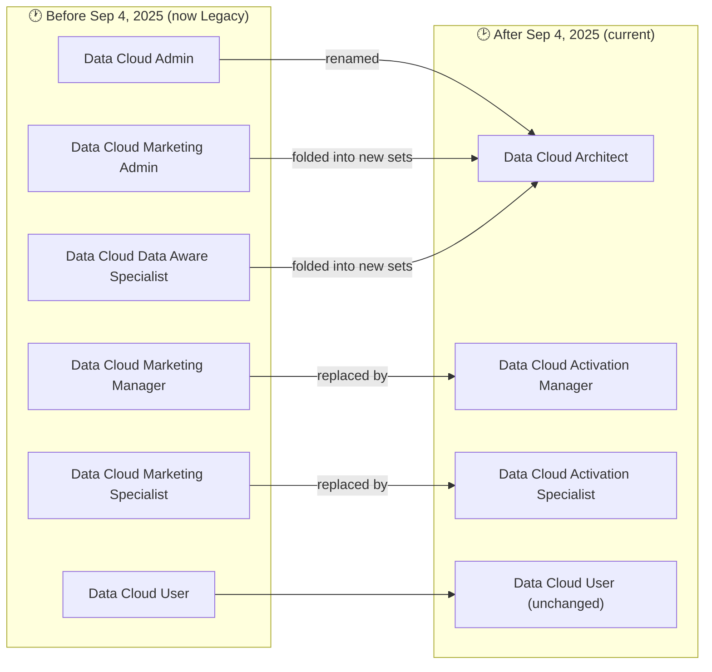
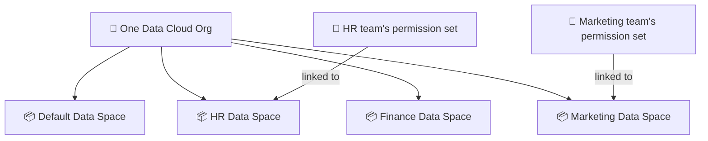

# 🔐 Data Cloud — Permission Sets & Data Spaces

> A plain-language guide to **who can do what** in Data Cloud (permission sets) and **how data is kept separate** (data spaces). Written in simple terms for study.
>
> *My own study notes, in my own words. Diagrams are original (Mermaid). The raw course slides and the Salesforce PDF are kept in a separate private folder, not published here.*

---

## 1. What is a permission set? (the simple version)

A **permission set** is just a bundle of access rights you assign to a user. It answers one question: *"What is this person allowed to see and do in Data Cloud?"*

Instead of setting access one checkbox at a time for every user, Salesforce gives you ready-made bundles for common job roles (admin, marketer, analyst, etc.). You assign the right bundle to the right person, and they instantly get the access that role needs — nothing more, nothing less.

> 🔑 **Think of it like keys to a building:** a permission set is a keycard. An admin's card opens every door; a regular user's card only opens the rooms they need.

There are two kinds:
- **Standard permission sets** — built and maintained by Salesforce. They **update automatically** every release as new features arrive.
- **Custom permission sets** — ones you build yourself when the standard ones don't fit (more on these in Section 6).

---

## 2. ⚠️ Big change you must know: September 4, 2025

This is the single most important thing in this whole topic, because your course PDF shows **two different sets of names** side by side and it's confusing until you know why.

**On September 4, 2025, Salesforce reorganized the Data Cloud permission sets.** Old ones became "**Legacy**," one was renamed, and new role-based ones were introduced. (Data Cloud was also **rebranded to "Data 360"** on October 14, 2025 — same product, new name.)

> 🔑 **Why it matters for the exam and real jobs:** legacy sets still *work*, but they **stop getting new features**. Salesforce recommends migrating to the new ones. So always reach for the **new** names.

---

## 3. The Core / Foundation Permission Sets

These are the everyday building blocks. First, the two that have always been central:

| Permission set | Who it's for | What they can do (simple) |
|---|---|---|
| **Data Cloud Admin** → now **Data Cloud Architect** | Key administrators with deep Salesforce skill | Complete control — configure Data Cloud, monitor the system, manage security, make platform-wide changes. Reserve this for very few people. |
| **Data Cloud User** | Team members who work *with* the data | View and analyze data, use dashboards and reports, explore profiles. Mostly **view-only** — promotes a data-driven culture while keeping things safe. |

There's also a special technical one:

- **Data Cloud Home Org Integration User** — included with every Data Cloud instance. It's for **connecting systems together**: setting up data integrations, managing synchronization, and troubleshooting connection issues. It helps reduce data silos.

> 💡 **Note on the Architect rename:** the renamed **Data Cloud Architect** set grants the "**Customize Application**" permission, which lets it reach **Setup**. If you want an architect who *can't* get into Setup, clone the set and remove that one permission. Also handy to know: a **System Administrator** profile can open Data Cloud Setup **without** any Data Cloud permission set.

---

## 4. The Marketing / Activation Permission Sets

These cover the "do marketing with the data" roles. **Important:** the old marketing names are now legacy — the table shows the old name and its current replacement together.

| Role focus | Legacy name (old) | Current name (new) | What they do (simple) |
|---|---|---|---|
| Marketing leadership | **Data Cloud Marketing Admin** | *folded into new sets* | Complete control over marketing operations — campaigns, audience segmentation, marketing workflows. |
| Data analysis | **Data Cloud Data Aware Specialist** | *folded into new sets* | Advanced data work — map data to the model, build data streams, identity resolution rules, and calculated insights; uncover customer trends. |
| Strategy & activation | **Data Cloud Marketing Manager** | **Data Cloud Activation Manager** | Own the overall segmentation strategy — create **activations** and **activation targets**, track campaign effectiveness. |
| Execution | **Data Cloud Marketing Specialist** | **Data Cloud Activation Specialist** | Hands-on execution — **create segments** and run targeted campaigns. |

---

## 5. Changed / Deprecated Permission Sets (the R&D table)

This is the summary of exactly what changed on September 4, 2025 — the deprecation map.

| Legacy set (before Sep 4, 2025) | Status now | Current replacement |
|---|---|---|
| **Data Cloud Admin** | 🔄 Renamed | **Data Cloud Architect** |
| **Data Cloud Marketing Manager** | ⚠️ Legacy — no new features | **Data Cloud Activation Manager** |
| **Data Cloud Marketing Specialist** | ⚠️ Legacy — no new features | **Data Cloud Activation Specialist** |
| **Data Cloud Marketing Admin** | ⚠️ Legacy | Functionality folded into the new role-based sets |
| **Data Cloud Data Aware Specialist** | ⚠️ Legacy | Functionality folded into the new governance/data sets |
| **Data Cloud User** | ✅ Unchanged | **Data Cloud User** |
| **Segmentation & Activation add-on** *(a license, not a permission set)* | 🚫 Retired | Its features were folded **into the main Data Cloud license** |

**Two more useful facts about the change:**
- The new sets are **"data space aware"** — you can grant access **per data space** directly on the permission set, without cloning or creating extra custom sets (see Section 8).
- There are also **two license names** you may see: the older **Customer Data Platform (CDP)** license (uses the old set names) and the current **Data 360 / Data Cloud** license (uses the new names). Check *Setup → Permission Sets → License field* to see which your org has.

> 📌 Salesforce publishes an official **"Data Cloud Standard Permission Set Transition Guide."** Since weightings and details shift each release, treat this doc as your study map and confirm exact current access against that guide.

---

## 6. Feature Access — Current Standard Sets (quick matrix)

Here's a simplified "who can touch what" grid for the **four current standard sets**. Legend: **Full** = create/edit/delete · **View** = view only · **—** = no access.

| Feature / Tab | Architect | Activation Manager | Activation Specialist | User |
|---|:---:|:---:|:---:|:---:|
| Data Cloud Setup | Full | — | — | — |
| Data Spaces | Full | — | — | View |
| Data Governance | Full | — | — | View |
| Data Shares | Full | — | — | View |
| Data Streams | Full | View | View | View |
| Data Lake Objects (DLOs) | Full | View | View | View |
| Data Model (DMOs) | Full | View | View | View |
| Data Transforms | Full | — | — | View |
| Data Graphs | Full | View | View | View |
| Data Explorer | View | View | View | View |
| Query Editor | Full | Full | Full | View |
| Identity Resolution | Full | View | View | View |
| Profile Explorer | View | View | View | View |
| Insights | Full | View | View | View |
| Data Actions | Full | Full | Full | View |
| Data Action Targets | Full | Full | View | View |
| Communication Capping | Full | Full | View | View |
| Segment | Full | Full | Full | View |
| Activations | Full | Full | Full | View |
| Activation Targets | Full | Full | View | View |
| Einstein Studio AI Models | Full | — | — | View |
| Unstructured Data Hub | Full | View | — | View |
| Search Index | Full | View | — | View |
| Semantic Layer | Full | — | — | View |

**How to read this in one glance:**
- **Architect** = the "everything" set (the old Admin).
- **Activation Manager** = full control over the *act-on-data* side (segments, activations, targets, data actions) + view access to the plumbing.
- **Activation Specialist** = can build **segments and activations**, but *not* set up targets/capping (view only there).
- **User** = mostly **view-only** across the board — safe for people who just need to look.

> ⚠️ *This grid is my study reconstruction of the official permission table for quick reference. Salesforce updates standard sets every release, so verify exact values against the official transition guide before relying on them for a real project or exam answer.*

---

## 7. Creating Custom Permission Sets

Sometimes the standard bundles don't line up perfectly with how *your* company splits responsibilities. That's when you make a **custom permission set**.

**The usual approach:**
1. **Clone** an existing (standard) permission set that's close to what you want.
2. **Adjust** the access rights to match your business need.
3. **Fine-tune** for a specific department or team.
4. **Combine** sets to build role-specific access.

The upside: users get *exactly* the access they need — nothing more, nothing less — which is good for both security and productivity.

> ⚠️ **The big catch (and a likely exam point):** custom permission sets **do NOT update automatically** when Salesforce ships new features. Standard sets do; custom ones don't. So if you rely only on a custom set, your users can silently miss access to brand-new functionality. Salesforce's own advice: prefer standard sets, and use custom ones only when you truly must.

---

## 8. What is a Data Space?

A **data space** is a **logical partition of your data** — a way to organize and separate data based on business needs. Think of it as putting your data into separate, walled-off rooms inside the same building.

You can use data spaces to separate:
- **Different departments** (HR, Sales, Finance)
- **Different regions** (Europe, Asia, US)
- **Different companies or brands or partners**
- Or any other split your business needs

Key facts:
- By default, all your data lives in one space called the **"default data space."**
- You **assign a data space through permission sets** — the new sets are "data space aware," so an admin links which spaces a permission set can reach (in **Data Space Management**).

### Example (to make it concrete)

Imagine a retail company that runs **two brands, "Brand A" and "Brand B."** For privacy and legal reasons, each brand's marketing team should only see *their own* customers.

- The admin creates two data spaces: **Brand A** and **Brand B**.
- Brand A's marketers get a permission set **linked to the Brand A data space**; Brand B's marketers get one **linked to Brand B**.
- Now Brand A's team physically cannot see Brand B's customer data, even though both brands live in the same Data Cloud org.

> 🔑 **One-line takeaway:** permission sets control **what features** you can use; data spaces control **which slice of data** you can use them on. Together they give precise "this person, these features, on this data" control.

---

## 9. Key Points for the Consultant Exam

Permission sets and data spaces live in the **Setup & Administration** part of the exam. Watch for these:

- **Assign, don't build.** Prefer **standard** permission sets; they auto-update. Custom sets risk missing new features — a very common "which is the best answer" trap.
- **Combine sets for broader access.** A user who needs more than one role's access should be given **multiple standard permission sets**, rather than a big custom one.
- **Architect = Customize Application.** The renamed **Data Cloud Architect** can reach **Setup** because it grants Customize Application; to block Setup, **clone and remove** that permission.
- **System Admin needs no Data Cloud set** to open Data Cloud Setup.
- **Data spaces = separation.** Use them for **legal/brand/region separation**. The right answer to "keep two groups' data apart" is usually *separate data spaces with permission sets linked to each* — **not** duplicating DMOs or DLOs.
- **Know the legacy → new mapping** (Admin→Architect, Marketing Manager→Activation Manager, Marketing Specialist→Activation Specialist).

---

## 🔁 Quick-Recall Flashcards

- **Q:** What is a permission set? → **A:** A bundle of access rights assigned to a user — it defines what they can see and do.
- **Q:** Standard vs custom permission sets? → **A:** Standard = Salesforce-built, auto-updates with new features; custom = you build it, does NOT auto-update.
- **Q:** What happened on Sep 4, 2025? → **A:** Data Cloud permission sets were reorganized — old ones became Legacy, Admin was renamed, new role-based sets were added.
- **Q:** Data Cloud Admin was renamed to…? → **A:** Data Cloud Architect.
- **Q:** Marketing Manager / Marketing Specialist became…? → **A:** Activation Manager / Activation Specialist.
- **Q:** Why avoid relying only on custom permission sets? → **A:** They don't automatically get access to new features Salesforce releases.
- **Q:** How does the Architect set reach Setup, and how do you stop it? → **A:** It grants Customize Application; clone the set and remove that permission to restrict Setup.
- **Q:** What is a data space? → **A:** A logical partition that separates data (by department, region, brand) within one org.
- **Q:** Where does all data go by default? → **A:** The "default data space."
- **Q:** How do you keep two brands' data separate? → **A:** Create separate data spaces and link each team's permission set to its own space.

---

## 📖 Glossary

| Term | Meaning (simple) |
|---|---|
| **Permission set** | A bundle of access rights assigned to a user. |
| **Standard permission set** | Salesforce-built bundle that auto-updates with new features. |
| **Custom permission set** | A bundle you build yourself; does not auto-update. |
| **Legacy permission set** | An old set that still works but gets no new features. |
| **Data Cloud Architect** | The renamed "Data Cloud Admin" — full control; grants Customize Application. |
| **Data Cloud Activation Manager** | Renamed "Marketing Manager" — owns segmentation/activation strategy. |
| **Data Cloud Activation Specialist** | Successor to "Marketing Specialist" — builds segments and activations. |
| **Data Cloud User** | Mostly view-only access for people who analyze data. |
| **Data space** | A logical partition separating data within one org. |
| **Default data space** | Where all data lives unless you create other spaces. |
| **Customize Application** | The permission (granted by Architect) that allows access to Setup. |

---

*Part of the Data Cloud repo. This covers access & security; other docs cover ingestion, identity resolution, segmentation, and activation.*
