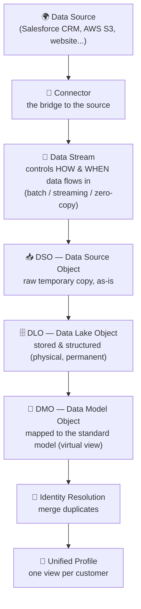
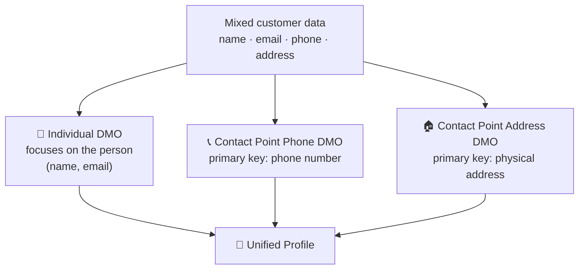
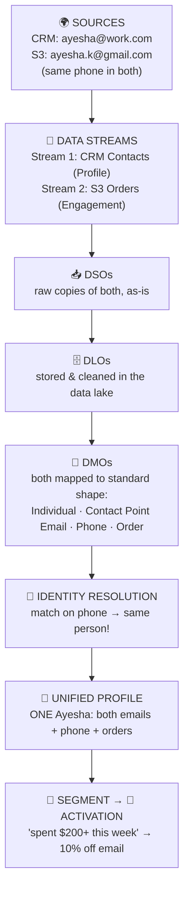

# 🧭 Data Cloud — The Tabs & The Data Journey (DSO → DLO → DMO)

> A plain-language, in-depth guide to how data moves through Data Cloud (the DSO → DLO → DMO journey), **a complete worked example**, **what every tab does**, and **interview questions** with answers.
>
> *My own study notes, in my own words. Diagrams are original (Mermaid). Raw course slides/scripts are kept in a separate private folder, not published here.*

---

# PART 1 — Core Concepts (learn these first)

Everything in Data Cloud is really one big journey: **raw data comes in → gets stored & structured → gets mapped to a standard shape → gets unified into one profile.** Here's that whole journey in one picture:

A simple way to remember the three objects — think of **cooking a meal**:
- **DSO** = the prep station where you dump the raw ingredients, exactly as they arrived.
- **DLO** = the chopping board where you clean, cut, and store the prepared ingredients.
- **DMO** = the finished, plated dish — arranged in a standard way, ready to serve.

## 1.1 Data Sources & Connectors

A **data source** is wherever your data comes from — a Salesforce CRM org, an AWS S3 bucket, a marketing platform, a website, a third-party app.

A **connector** is the ready-made bridge that links a source to Data Cloud so data can flow in accurately. Salesforce ships a long (and growing) list of connectors, so you usually just pick one and configure it instead of building an integration by hand.

> **Example:** In your course you'll connect two sources — a **Salesforce CRM** org and an **AWS S3** bucket — using their connectors.

## 1.2 Data Stream (the "pipe")

A **data stream** is the pipe that actually pulls data from a source into Data Cloud. When you create one, you choose a source and then decide **how and when** the data comes in:
- **Batch** — refreshed on a schedule (e.g. every hour).
- **Streaming** — flows in near-real-time as it happens.
- **Zero-copy** — Data Cloud reads it *in place* from an external warehouse (like Snowflake) without copying it in.

When you create a data stream you also pick a **category** — this matters later:

| Category | Use it for | Example |
|---|---|---|
| **Profile** | Who the person *is* (demographic/contact data) | Name, email, phone, address |
| **Engagement** | What the person *did* (time-stamped events) | Email opens, clicks, purchases |
| **Other** | Reference/lookup data that's neither | Product catalog, store list |

## 1.3 DSO — Data Source Object

> ℹ️ **Name note:** your video calls this a "Data Streaming Object" and the linked article/interview file call it a "Data Staging Object." The common Salesforce term is **Data Source Object (DSO)** — but all three describe the *same thing and the same job* (a temporary staging store), so don't let the wording confuse you.

The **DSO** is where the data first lands when the stream runs. It's a **raw, temporary copy** of the incoming data, kept in its **original/native format** (like a CSV), with little or no change. You can apply tiny tweaks here (a formula to reformat a date, for example), but mostly it's an as-is snapshot.

Think of it as the **holding area** right at the door.

## 1.4 DLO — Data Lake Object

The **DLO** is the next stage, and it's the **first object you can actually inspect and prepare.** This is where the data becomes **stored and structured** — you map fields and apply transformations here.

Key fact (and a favorite exam/interview point): the **DLO is physical and permanent** — the actual data really lives here, stored in the data lake (Amazon S3) in an efficient columnar format called **Parquet**. So of the three objects, **the DLO is the one that truly holds your data.**

## 1.5 DMO — Data Model Object (harmonization happens here)

The **DMO** is where **harmonization** happens — taking your structured data and mapping it into a **standard, common shape** so everything speaks the same language.

The clever idea: Data Cloud **breaks your data into focused buckets**, each organized around a **primary key** (a field that uniquely identifies a record):

So one DMO focuses on email/identity, another on phone, another on address — and so on. This split is what later lets Data Cloud spot and remove duplicates cleanly.

**Two more important DMO facts:**
- **Standard vs custom:** Data Cloud ships many ready-made ("out-of-the-box") DMOs — like **Individual**, **Contact Point Phone**, **Contact Point Email**, **Contact Point Address**. You can also build **custom DMOs** for data that doesn't fit.
- **DMO is virtual (no storage).** Unlike the DLO, a **DMO does not physically store data** — it's a live *view* over the DLOs, always showing the current data. (It also inherits its **category** from the first DLO mapped to it, and after that only same-category DLOs can map to it.)

## 1.6 The one comparison you must know: DSO vs DLO vs DMO

| | **DSO** | **DLO** | **DMO** |
|---|---|---|---|
| Full name | Data Source Object | Data Lake Object | Data Model Object |
| Its job | Raw landing copy | Store & structure the data | Map to the standard model |
| Storage | Physical but **temporary** | **Physical & permanent** (Parquet in the lake) | **Virtual** — not stored at all |
| Data format | Raw/native (as-is) | Cleaned, columnar | A live view/query |
| Can you inspect it? | Not really | ✅ First object you can inspect | ✅ Yes |
| What you do here | Minor tweaks at ingestion | Map fields, transform | Build segments, insights, queries; run identity resolution |

> 🔑 **Interview one-liner:** *"Why two objects (DSO and DLO) instead of one?"* → They split the work: the **stream/DSO** side handles **how the data comes in** (frequency & raw capture), and the **DLO** side handles **storing and structuring** it. Then the **DMO** gives it a standard, unified shape.

## 1.7 Unified Profile

After the DMOs are built and **identity resolution** removes duplicates, Data Cloud produces the **Unified Profile** — a single, complete view of each customer stitched together from every source. This is the whole point of the journey, and it's what powers personalization, segmentation, and AI.

---

# PART 2 — A Complete Worked Example (end to end) 🎬

Let's trace **one real customer through every single stage**, so the whole pipeline clicks. Follow **Ayesha**, a customer of a fictional retailer called **StyleHub**.

**The setup — StyleHub has Ayesha's data in two disconnected places:**
- **Salesforce CRM** (their sales/service system): Ayesha is a Contact — *Name: Ayesha Khan, Email: ayesha@work.com, Phone: 0300-1234567*.
- **E-commerce site export in AWS S3**: Ayesha shopped online but signed up with a *different* email — *Email: ayesha.k@gmail.com, Phone: 0300-1234567, Order: boots, $220, yesterday*.

Notice the problem: **two different emails**, so the two systems think she's two different people. Watch how Data Cloud fixes this.

**Step by step:**

1. **Connect the sources.** Use the **Salesforce CRM connector** for the CRM and the **Amazon S3 connector** for the e-commerce export.

2. **Create the data streams.** One stream pulls CRM Contacts (category **Profile**), another pulls the S3 orders file (category **Engagement**). You pick **batch** refresh (say, hourly).

3. **Data lands in DSOs.** Each stream drops a **raw, as-is copy** into its DSO — the CRM row exactly as it was, the S3 CSV rows exactly as they were. You reformat the order date with a quick formula. *(Temporary staging — nothing permanent yet.)*

4. **Data becomes DLOs.** Now the data is **physically stored and structured** in the data lake (as Parquet). You get, say, a `CRM_Contact` DLO and an `Ecom_Orders` DLO, and you inspect them to confirm they landed correctly. *(This is where Ayesha's data physically lives.)*

5. **Map to DMOs (harmonize).** You map fields from both DLOs onto the **standard model**:
   - Ayesha's identity → **Individual DMO**
   - Both her emails → **Contact Point Email DMO** (two email rows, same person)
   - Her phone → **Contact Point Phone DMO**
   - Her boots order → an **Order/Engagement DMO**

   Now both sources speak the same "language," even though they started differently.

6. **Identity resolution merges her.** You set a **match rule on phone number.** Both sources have `0300-1234567`, so Data Cloud realizes CRM-Ayesha and Ecom-Ayesha are **one person** — despite the different emails. A **reconciliation rule** (say, "most recent") decides which name/detail wins if they differ.

7. **One Unified Profile appears.** There's now a single **Ayesha Khan**, carrying *both* emails, her phone, and her full order history — instead of two half-pictures.

8. **Segment.** You build a segment: *"customers who spent $200+ in the last 7 days."* Ayesha's $220 boots order means she qualifies.

9. **Activate.** You publish that segment to **Marketing Cloud** (the activation target). Ayesha gets a personalized *10%-off-your-next-order* email — and because **Communication Capping** is set to "max 2 emails/week," she won't be spammed.

> 🔑 **The payoff:** the exact fragmented mess we started with (two emails, two systems, no idea it's one person) became **one unified customer** who receives one smart, relevant message. That entire transformation *is* Data Cloud.

**Where things physically exist in this story:** the **DLOs** hold Ayesha's real data; the **DMOs** are just virtual views over them; the **Unified Profile** is the merged result of identity resolution. Nothing is duplicated unnecessarily.

---

# PART 3 — The Tabs in the Data Cloud App

Each tab is responsible for one part of that journey. Here they are, grouped by stage. For each: what it is, what you do there, and a mini example.

## 🔌 Connect & Ingest

- **Data Streams** — where you create the pipes that pull data in. *You do:* pick a source/connector, choose batch/streaming/zero-copy, set the category. *Example:* create a stream from your CRM's Contacts.
- **Data Lake Objects (DLOs)** — where the ingested data is stored and first prepared. *You do:* inspect the raw data, map and clean fields. *Example:* check that the orders data landed correctly.
- **Data Transforms** — reshape data with steps a DMO can't do. *You do:* join, split, merge, reformat data (batch or streaming). *Example:* reformat a messy date field. *(Runs after ingestion; streaming transforms work on DLOs, one record at a time.)*

## 📐 Model & Harmonize

- **Data Model (DMOs)** — where you map DLO fields onto the standard model. *You do:* map to standard DMOs (Individual, Contact Point…) or build custom ones. *Example:* map your CRM email field to the Contact Point Email DMO.
- **Data Graphs** — a pre-joined, cached bundle of related DMOs for fast, real-time access. *You do:* package a customer + their orders + their cases together so apps/agents can read them instantly. *Example:* a graph that powers a real-time personalization widget.

## 🔍 Explore & Query

- **Data Explorer** — a point-and-click **preview** of your data (no coding). *You do:* browse your DLOs/DMOs to sanity-check them. *Example:* peek at a unified record to confirm the merge looks right. *(For non-developers.)*
- **Profile Explorer** — view a single **unified customer profile** in one place. *You do:* see everything known about one person across sources.
- **Query Editor** — write **SQL** to query your data directly. *You do:* run custom queries for deeper analysis. *Example:* count customers per city. *(For developers — more powerful than Data Explorer.)*

## 🧠 Unify

- **Identity Resolution** — merge duplicate records into one profile. *You do:* set **match rules** (who is the same person) and **reconciliation rules** (which value wins). *Example:* merge two records that share a phone number.

## 📊 Analyze & Predict

- **Insights (Calculated Insights)** — compute meaningful metrics across your data. *You do:* build metrics like lifetime value or engagement score. *Example:* total spend per customer.
- **Einstein Studio / AI Models** — bring your own machine-learning models (BYOM). *You do:* connect predictive models that run on your unified data. *Example:* a churn-prediction model. *(Usually built by your ML/data-science team.)*
- **Semantic Layer** *(Tableau Semantics)* — a business-friendly, dashboard-style view with defined metrics and relationships. *You do:* define reusable business metrics so reporting is consistent. *(The video says "symmetric layer" — the correct name is **Semantic Layer**.)*

## 🚀 Act on Data

- **Segments** — split customers into groups by attributes. *You do:* build audiences from filters. *Example:* "customers who bought shoes in the last 30 days."
- **Activations** — send a segment out to another system to act on. *You do:* publish a segment to a destination. *Example:* push an audience to Marketing Cloud for an email journey.
- **Activation Targets** — the **destinations** activations publish to. *You do:* set up where audiences go. *Example:* a Marketing Cloud or ad-platform target.
- **Data Actions** & **Data Action Targets** — trigger something automatically when data changes. *You do:* fire an event/email when a condition is met. *Example:* when a high-value customer does X, send an alert. *(These two work together.)*
- **Communication Capping** — limit how many messages a customer gets. *You do:* set rules like "max 3 emails per week per person." *(The video says "communication mapping" — the correct name is **Communication Capping**.)*

## 🛡️ Govern & Administer

- **Data Spaces** — logical partitions that separate data (by brand, region, department). *You do:* keep different groups' data walled off. *Example:* separate "Brand A" and "Brand B" customers.
- **Data Governance** — controls for privacy, security, and access to data. *You do:* set policies, masking, and field/record-level access.
- **Data Shares** — securely share Data Cloud data out to external platforms. *You do:* share data with Snowflake, BigQuery, etc. (often zero-copy).

## 🔎 Search & Speed

- **Search Index** — like a directory/lookup table Salesforce builds on top of your DMOs to make searching a specific field fast. *You do:* mark fields (email, phone, customer ID) as indexed so queries run quickly. *Example:* fast lookup by email.

## 📈 Visualize

- **Reports & Dashboards** — view your data using Salesforce's built-in reporting. *You do:* build standard reports/dashboards once the data is ready.

---

# PART 4 — Newer Tabs You Should Know

Data Cloud (now **Data 360**) keeps adding tabs, mostly to support **AI and Agentforce**. If your course video is a bit older, these are the ones most likely to be new to you — explained simply:

| Newer tab | What it does (simple) | Why it exists |
|---|---|---|
| **Unstructured Data Hub** | Brings in documents, PDFs, transcripts — not just tables. | So AI can use your files, not only structured data. |
| **Search Index → Vector / Hybrid Search** | Smarter search that finds by *meaning*, not just exact matches. | Powers **RAG** so AI agents retrieve the right info. |
| **Semantic Layer** (Tableau Semantics) | Defines business metrics and relationships once, reused everywhere. | Consistent analytics + AI that understands your business terms. |
| **Data Governance** | Central place for privacy, masking, and access policies. | Compliance (GDPR/HIPAA) baked in. |
| **Clean Rooms** | Safely match data with a partner *without either side seeing raw data*. | Privacy-safe collaboration (e.g. with advertisers). |
| **Notebook AI** | An AI-assisted workspace to explore and research your data. | Faster insights with less manual querying. |

> 🔑 The pattern to notice: almost every new tab is about **feeding clean, unified, well-governed data into AI** — which is exactly why the Data Cloud + Agentforce combination is so valuable right now.

---

# PART 5 — Interview Questions & Answers

Common interview questions on DSO, DLO, DMO, and unified profiles, with concise answers in plain language.

> ℹ️ **Heads-up on wording:** these questions use **"Data Staging Objects" for DSO** (the course's phrasing). Salesforce's more common term is **Data Source Object**, but both mean the same temporary staging object — answer with whichever term your interviewer uses, and you can mention you know both.

### On DSOs

**1. What is a DSO and what's it for?**
A DSO is a **temporary holding area** where freshly ingested data sits *before* further processing. It captures the raw data as-is, keeps it organized for the next steps, and is where early data modeling and field mapping begin. *Example:* customer data pulled from a CRM lands in a DSO before it's categorized and unified.

**2. How does a DSO help with data accuracy and readiness?**
Because you can do initial organizing, light transformation, and mapping at the DSO stage, the data is checked and shaped *before* it becomes permanent — so what moves forward is cleaner and matches your goals. *Example:* mapping raw transaction data to product categories at this stage sets up accurate consumption analysis later.

### On DLOs

**3. How is a DLO different from a DSO?**
A DSO is **temporary staging**; a DLO is **persistent storage**. Data is first staged and lightly prepared in the DSO, then moved into the DLO for long-term keeping and heavier operations (historical analysis, reporting). *Example:* after cleaning contact data in a DSO, it's stored in a DLO for monthly trend reports.

**4. What do businesses gain from DLOs?**
Reliable, permanent storage that keeps data available and consistent over time, and supports complex, long-term analysis. *Example:* an e-commerce company keeps behavior data in DLOs to fuel predictive, long-running marketing.

### On DMOs

**5. What is a DMO and how does it improve organization?**
A DMO is a **logical, standardized view** of your data. It defines a common structure so data from many sources can be accessed and analyzed consistently, and it's the blueprint that feeds unified profiles. *Example:* an Individual/Contact DMO organizes names, phones, and emails into one structured shape.

**6. Why is the Individual/Contact DMO important?**
It focuses on **person-level data** (name, contact details), which makes it easy to retrieve a complete customer profile and to personalize engagement. *Example:* CRM and social data both flow into the Contact DMO to build one cohesive marketing view.

**7. How do Contact Point Phone / Contact Point Email DMOs help communication?**
They **standardize** how phone and email data are collected and tracked, so interactions stay consistent across systems and teams. *Example:* a support team uses the Contact Point Email DMO to track queries and follow up on time.

### On Unified Profiles

**8. What are unified profiles and why do they matter?**
They **combine data from many sources into one complete view** of each customer. This removes silos, keeps every team consistent, and enables real personalization and better decisions. *Example:* a retailer merges online and in-store behavior to tailor campaigns per customer.

**9. How do unified profiles improve personalization?**
With a full view of what a customer has done and prefers, teams can respond relevantly and consistently. *Example:* if someone browses online then contacts support, both activities are visible to sales and service, so the follow-up is informed.

### Scenario-Based

**10. Describe the DSO → DLO transition and why it matters.**
Data is first staged and modeled in the temporary DSO, then the refined data is moved to the persistent DLO for long-term use. This protects **data integrity** while enabling advanced analysis. *Example:* interaction data is refined in a DSO, then stored in a DLO for yearly forecasting.

**11. How would you use DMOs to build a unified engagement strategy?**
Use DMOs like Individual and Contact Point Email/Phone to pull customer data from many sources into one standardized system, so teams can engage consistently across channels. *Example:* a telecom identifies customers via the Contact DMO and follows up on offers via the Contact Point Phone DMO.

**12. A marketing team has fragmented data across sources — how does Data Cloud fix it?**
Connectors bring the sources in, data is staged (DSO) and stored (DLO), and DMOs map everything into standardized profiles — so fragmentation disappears and everyone works from one unified view. *Example:* CRM, survey, and event email lists are consolidated into one profile for targeted campaigns.

---

# PART 6 — Study Aids

## ✅ Key Takeaways

1. The journey: **Source → Connector → Data Stream → DSO → DLO → DMO → Identity Resolution → Unified Profile.**
2. **DSO** = raw temporary copy · **DLO** = physical permanent stored data (Parquet) · **DMO** = virtual mapped view (no storage).
3. **DMOs harmonize** by splitting data into buckets around primary keys (email, phone, address).
4. **Data streams have categories** — Profile, Engagement, Other.
5. Each **tab** maps to a stage: connect, model, explore, unify, analyze, act, govern.
6. **Newer tabs** (Unstructured Data Hub, Vector Search, Clean Rooms, Notebook AI) all point toward **AI/Agentforce**.

## 🔁 Flashcards

- **Q:** What are DSO, DLO, DMO? → **A:** Data Source Object (raw temp copy), Data Lake Object (physical stored/structured data), Data Model Object (virtual mapped view).
- **Q:** Which of the three physically stores your data? → **A:** The DLO (materialized as Parquet in the data lake). The DMO stores nothing.
- **Q:** Why split DSO and DLO? → **A:** DSO/stream handles *how data comes in* (frequency, raw capture); DLO handles *storing & structuring* it.
- **Q:** What does a DMO do? → **A:** Maps data to a standard model and splits it into buckets by primary key (email, phone, address) — harmonization.
- **Q:** Three data stream categories? → **A:** Profile, Engagement, Other.
- **Q:** Data Explorer vs Query Editor? → **A:** Explorer = point-and-click preview (non-devs); Query Editor = write SQL (devs, more powerful).
- **Q:** What does Communication Capping do? → **A:** Limits how many messages a customer receives.
- **Q:** Where does harmonization happen? → **A:** At the DMO stage.

## 📖 Glossary

| Term | Meaning (simple) |
|---|---|
| **Data Source** | Where data comes from (CRM, S3, website). |
| **Connector** | The ready-made bridge to a data source. |
| **Data Stream** | The pipe that pulls data in; sets frequency & category. |
| **DSO (Data Source Object)** | Raw, temporary copy of incoming data. |
| **DLO (Data Lake Object)** | Physical, permanent stored & structured data (Parquet). |
| **DMO (Data Model Object)** | Virtual view mapping data to the standard model. |
| **Harmonization** | Mapping/standardizing data into common buckets. |
| **Primary key** | A field that uniquely identifies a record. |
| **Category** | A data stream label: Profile, Engagement, or Other. |
| **Identity Resolution** | Merging duplicate records into one profile. |
| **Unified Profile** | The single, complete view of a customer. |
| **Data Graph** | A pre-joined, cached bundle of related DMOs for fast access. |
| **Semantic Layer** | Business-friendly defined metrics/relationships for analytics & AI. |

---

*Part of the Data Cloud repo. This covers the data journey, a worked example, the app's tabs, and interview prep; other docs cover concepts, permission sets, identity resolution, and the exam.*
